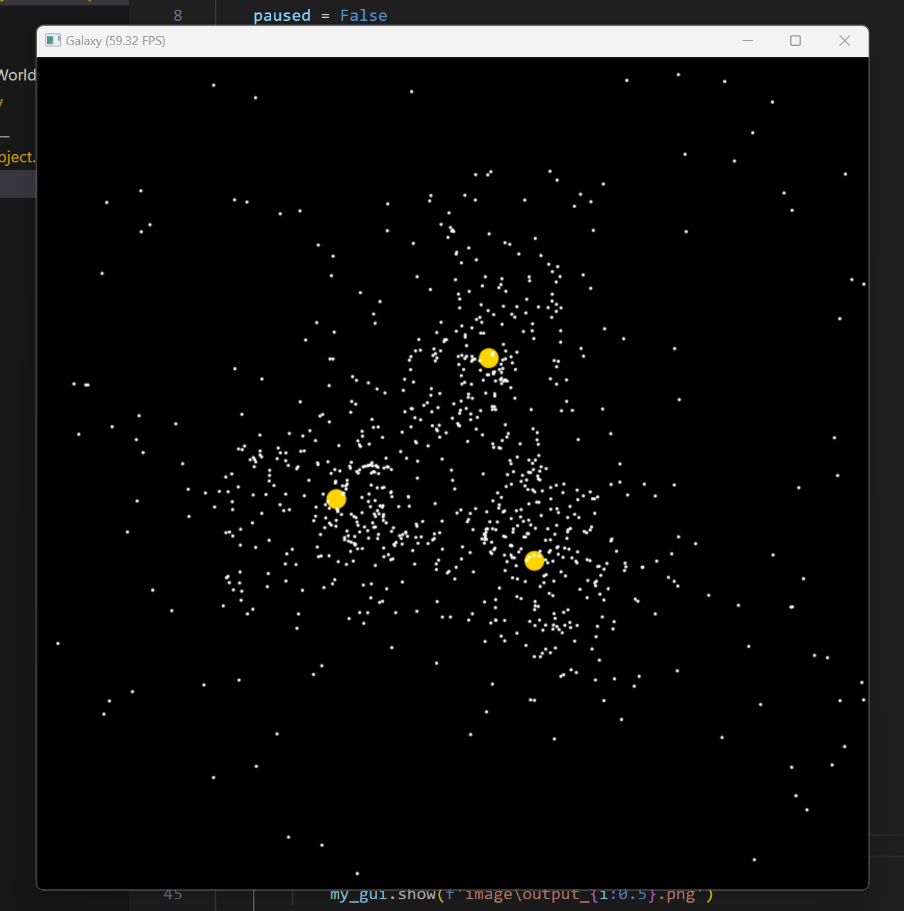

## 加入恒星的多体引力

celestial_object.py

```python
import taichi as ti

# constants
G = 1
PI = 3.1415926

@ti.data_oriented
class CelestialObject:
    def __init__(self, N, mass):
        self.n = N
        self.m = mass
        self.pos = ti.Vector.field(2, ti.f32, shape=self.n)
        self.vel = ti.Vector.field(2, ti.f32, shape=self.n)
        self.force = ti.Vector.field(2, ti.f32, shape=self.n)

    def display(self, gui, radius=2, color=0xffffff):
        gui.circles(self.pos.to_numpy(), radius=radius, color=color)

    @ti.func
    def Pos(self):
        return self.pos

    @ti.func
    def Mass(self):
        return self.m

    @ti.func
    def Number(self):
        return self.n

    @ti.func
    def clearForce(self):
        for i in self.force:
            self.force[i] = ti.Vector([0.0, 0.0])

    @ti.kernel
    def initialize(self, center_x: ti.f32, center_y: ti.f32, size: ti.f32, init_speed: ti.f32):
        for i in range(self.n):
            if self.n == 1:
                self.pos[i] = ti.Vector([center_x, center_y])
                self.vel[i] = ti.Vector([0.0, 0.0])
            else:
                theta, r = self.generateThetaAndR(i, self.n)
                offset_dir = ti.Vector([ti.cos(theta), ti.sin(theta)])
                center = ti.Vector([center_x, center_y])
                self.pos[i] = center+r*offset_dir*size
                self.vel[i] = ti.Vector(
                    [-offset_dir[1], offset_dir[0]])*init_speed

    @ti.kernel
    def computeForce(self):
        self.clearForce()
        for i in range(self.n):
            p = self.pos[i]
            for j in range(self.n):
                if j != i:
                    diff = self.pos[j]-p
                    r = diff.norm(1e-2)
                    self.force[i] += G*self.Mass()*self.Mass()*diff/r**3

    @ti.kernel
    def update(self, h: ti.f32):
        for i in self.vel:
            self.vel[i] += h*self.force[i]/self.Mass()
            self.pos[i] += h*self.vel[i]

@ti.data_oriented
class Star(CelestialObject):
    def __init__(self, N, mass):
        super().__init__(N, mass)

    @staticmethod
    @ti.func
    def generateThetaAndR(i, n):
        theta = 2*PI*i/ti.cast(n, ti.f32)
        r = 1
        return theta, r

@ti.data_oriented
class Planet(CelestialObject):
    def __init__(self, N, mass):
        super().__init__(N, mass)

    @staticmethod
    @ti.func
    def generateThetaAndR(i, n):
        theta = 2*PI*ti.random()
        r = ti.sqrt(ti.random())*0.4+0.6
        return theta, r

    @ti.kernel
    def computeForce(self, stars: ti.template()):
        self.clearForce()
        for i in range(self.n):
            p = self.pos[i]
            for j in range(self.n):
                if i != j:
                    diff = self.pos[j]-p
                    r = diff.norm(1e-2)
                    self.force[i] += G*self.Mass()*self.Mass()*diff/r**3
            for j in range(stars.Number()):
                diff = stars.Pos()[j]-p
                r = diff.norm(1e-2)
                self.force[i] += G*self.Mass()*stars.Mass()*diff/r**3
```

main.py

```python
import taichi as ti
from celestial_object import Star, Planet

if __name__ == '__main__':
    ti.init(arch=ti.cuda)

    # control
    paused = False
    export_images = False

    # stars and planets
    stars = Star(N=3, mass=1000)
    stars.initialize(0.5, 0.5, 0.2, 10)
    planets = Planet(N=1000, mass=1)
    planets.initialize(0.5, 0.5, 0.4, 10)

    # GUI
    my_gui = ti.GUI('Galaxy', (800, 800))
    h = 5e-5
    i = 0
    while my_gui.running:
        for e in my_gui.get_events(ti.GUI.PRESS):
            if e.key == ti.GUI.ESCAPE:
                exit()
            elif e.key == ti.GUI.SPACE:
                paused = not paused
                print('paused = ', paused)
            elif e.key == 'r':
                stars.initialize(0.5, 0.5, 0.4, 10)
                planets.initialize(0.5, 0.5, 0.4, 10)
                i = 0
            elif e.key == 'i':
                export_images = not export_images
        
        if not paused:
            stars.computeForce()
            planets.computeForce(stars)
            for celestial_obj in (stars,planets):
                celestial_obj.update(h)
            i+=1
        
        stars.display(my_gui,radius=10,color=0xffd500)
        planets.display(my_gui)
        if export_images:
            my_gui.show(f'image\output_{i:0.5}.png')
        else:
            my_gui.show()
```



2024.2.6