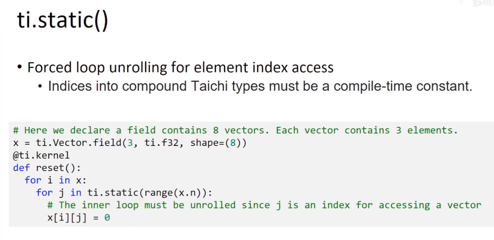

## 元编程

Metaprogramming


提升代码复用性

### 概念

凌驾于编程之上的程序


### 应用

* 编写与维度无关的code

* 加速代码执行

### meta programming 编写与维度无关的code

二维三维都能用

ex: 将一个taichi field拷贝到另一个

native python solution

```python
def copy_4(src,dst):
    for i in range(4):
        dst[i]=src[i]

a=ti.field(ti.f32,4)
b=ti.field(ti.f32,4)

copy_4(a,b)
```

a more clever python solution

```python
def copy(src,dist,size):
    for i in range(size):
        dst[i]=src[i]

a=ti.field(ti.f32,4)
b=ti.field(ti.f32,4)
c=ti.field(ti.f32,12)
d=ti.field(ti.f32,12)

copy(a,b,4)
copy(c,d,12)
```

taichi实现 [可以进行并行优化]

```python
@ti.kernel
def copy(src:ti.template(),dst:ti.template()):
    for i in src:
        dst[i]=src[i]

a=ti.field(ti.f32,4)
b=ti.field(ti.f32,4)
c=ti.Vector.field(ti.f32,12)
d=ti.Vector.field(ti.f32,12)

copy(a,b,4)
copy(c,d,12)
```

<h5 style="color:yellow; background-color:black; padding:5px">ti.template
</h5>

支持taichi认识的任何东西(field, vector...)，taichi模板


ti.template执行的是引用传递

##### 维度问题

当我们需要拷贝高维field的时候，需要的循环结构就不一样了

```python
for i,j in src:
    ......
```


我们需要写好几个函数来处理不同的维度


<h5 style="color:yellow; background-color:black; padding:5px">ti.grouped()</h5>

```python
@ti.kernel
def copy(x:ti.template(),y:ti.template()):
    for I in ti.grouped(y):
        # I is a vector with dimensionality same to y
        # if y is 0D, then I=ti.Vector([]), which is equal to `None` used in x[I]
        # if y is 1D, then I=ti.Vector([i])
        # if y is 2D, then I=ti.Vector([i,j])
        # if y is 3D, then I=ti.Vector([i,j,k])
        # ...
        x[I]=y[I]
```

### Metadata

描述数据的数据

#### Field的metadata

Field

* dtype: type of a field

* shape: shape of a field

```python
import taichi as ti
ti.init(arch=ti.cpu,debug=True)

@ti.kernel
def copy(src:ti.template(),dist:ti.template()):
    assert src.shape==dst.shape
    for i in dst:
        dst[i]=src[i]

a=ti.field(ti.f32,4)
b=ti.field(ti.f32,100)
copy(a,b)
```

#### Matrix/Vector的metadata

Matrix/Vecotr

* matrix.n: rows of a mat

* matrix.m: cols of a mat/vec

```python
@ti.kernel
def foo():
    matrix=ti.Matrix([[1,2],[3,4],[5,6]])
    print(matrix.n,matrix.m) # 3,2
    vector=ti.Vector([7,8,9])
    print(vector.n,vector.m) # 3,1
```

### template的原理


对于没见过的template参数，taichi会重新编译template

### meta programming 加速代码执行

可以在编译的时候给到编译器一些hint，并且利用这些hint来加速代码

<h5 style="color:yellow; background-color:black; padding:5px">ti.grouped()</h5>

#### 分支削减

类似于#define

```python
enable_projection=False

x=ti.field(ti.f32,shape=10)

@ti.kernel
def static():
    if ti.static(enable_projection):
        x[0]=1
```

上述代码中的enable_projection在代码运行过程中是不会变化的

整个if语句会被砍掉

#### 循环展开

```python
@ti.kernel
def foo():
    for i in ti.static(range(4)):
        print(i)

# is equivalent to
@ti.kernel
def foo():
    print(0)
    print(1)
    print(2)
    print(3)
```

有些时候循环 unroll 展开是必须的



2024.2.5
