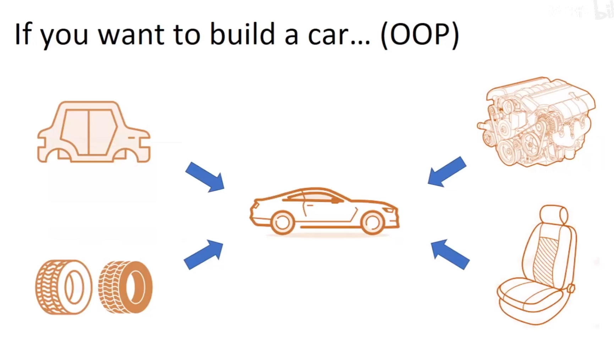

## 面向对象编程

OOP

### 面向过程和面向对象





### ODOP

objective data-oriented programming

面向数据+面向对象

```python
@ti.data_oriented
class TaichiWheel:
    def __init__(self,radius,width,rolling_fric):
        self.radius=radius
        self.width=width
        self.rolling_frac=rolling_frac
        self.pos=ti.Vector.field(3,ti.f32,shape=4)

    @ti.kernel
    def Roll(self):
        ...

    @ti.func
    def foo(self):
        ...
```

经过ti.data_oriented修饰的类，可以用ti.kernel ti.func修饰成员函数，编译出更高性能的程序

### SOA和AOS

假设我们需要存放一个班学生的年龄身高成绩数据

可以这样

```python
class Student:
    def __init__(self):
        self.age=...
        self.height=...
        self.grade=...
```

也可以创建三个大的数组，分别存放全班的年龄身高成绩数据

taichi倾向于后一种，这也是taichi data-oriented的设计思想

```python
@ti.data_oriented
class CelestialObject:
    def __init__(self):
        self.pos=ti.Vector(2,ti.f32,shape=N)
        self.vel=ti.Vector(2,ti.f32,shape=N)
        self.force=ti.Vector(2,ti.f32,shape=N)
```

这样的数据结构可以被taichi以更高效的方式执行

2024.2.5
