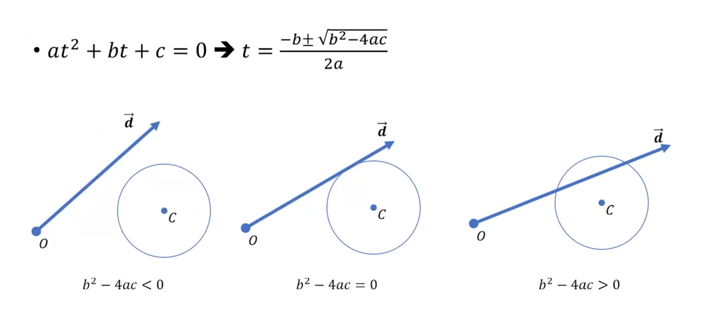
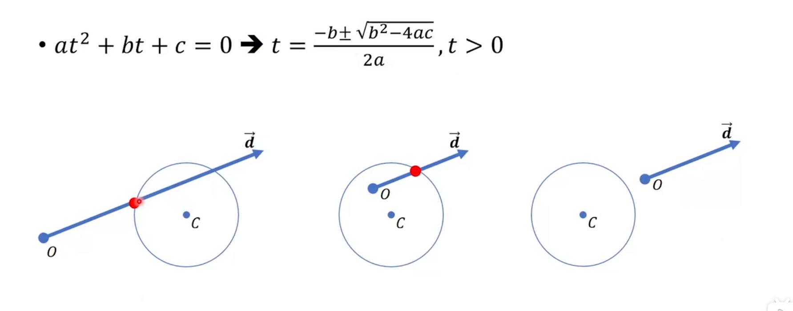
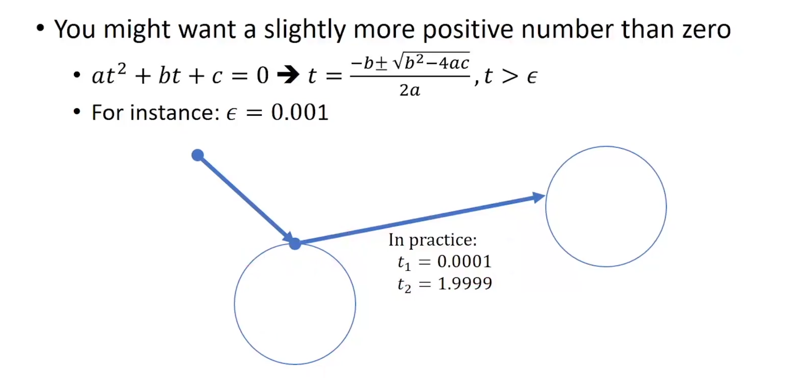
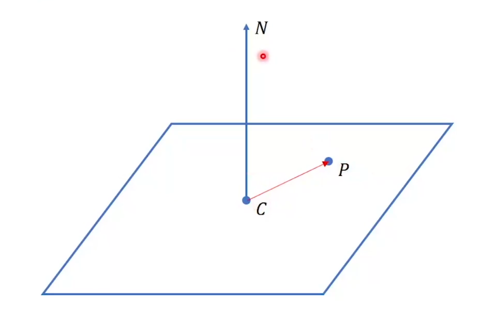
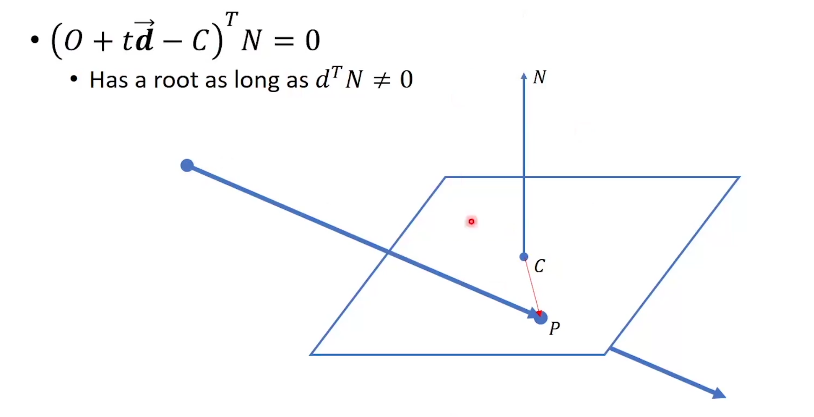
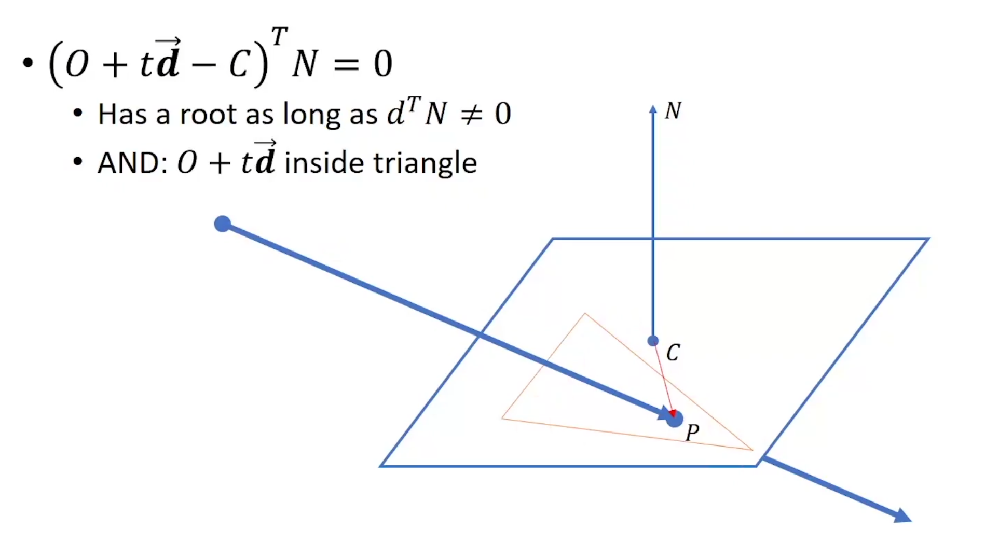
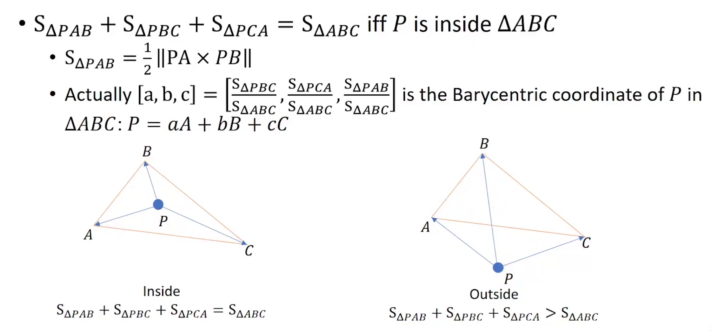
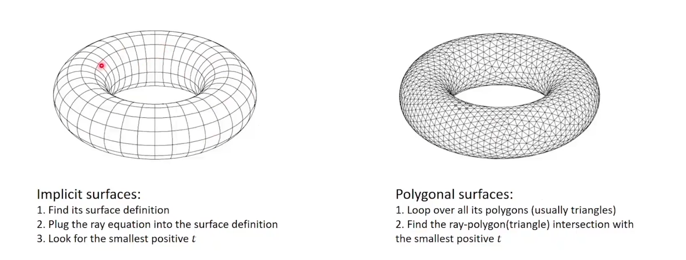

## 光线和物体求交

### 射线方程

射线的参数方程形式

$P=O+t\overrightarrow{d}$

### 球面方程

球的参数方程形式

$||P-C||^2-r^2=0$

### 射线和球相交

$||O+t\overrightarrow{d}-C||^2-r^2=0$

解出来又解不代表光线一定和球有交点

我们需要寻找第一个正的实根作为交点

#### 计算机的精度问题

计算机给出的实根也有可能非常接近于0，导致光线和物体自身产生交点

需要把>0的限制往上提一提

### 射线和平面求交点

定义平面：

平面上任意一点和给定点的连线垂直于平面的法向

$(P-C)^TN=0$

联立射线方程

$(O+t\overrightarrow{d}-C)^TN=0$

### 射线和三角形求交

判断和平面相交后，再判断交点在不在三角形内

#### 重心坐标

### 两种物体和射线求交的方式

2024.2.24