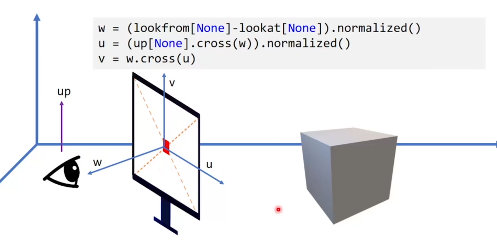
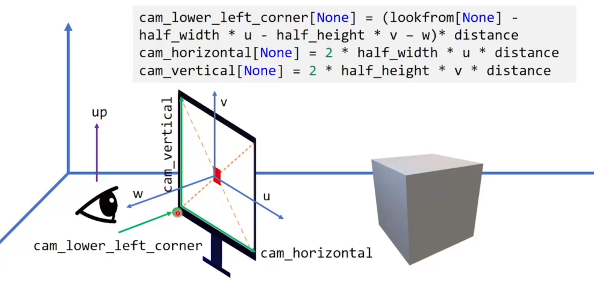
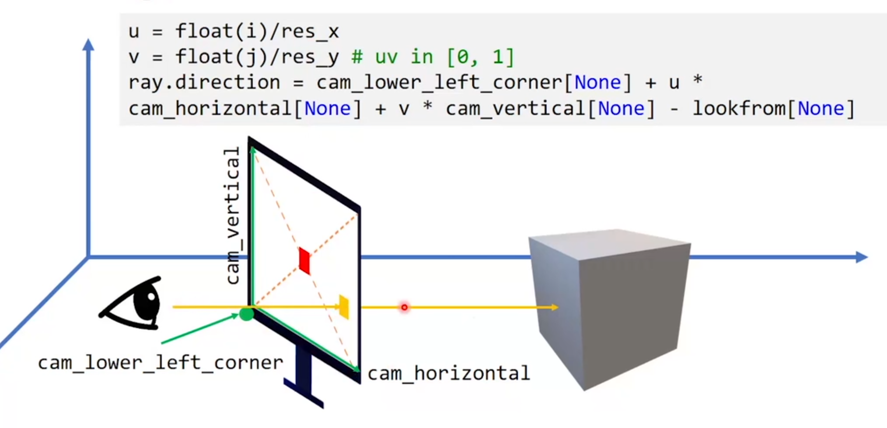
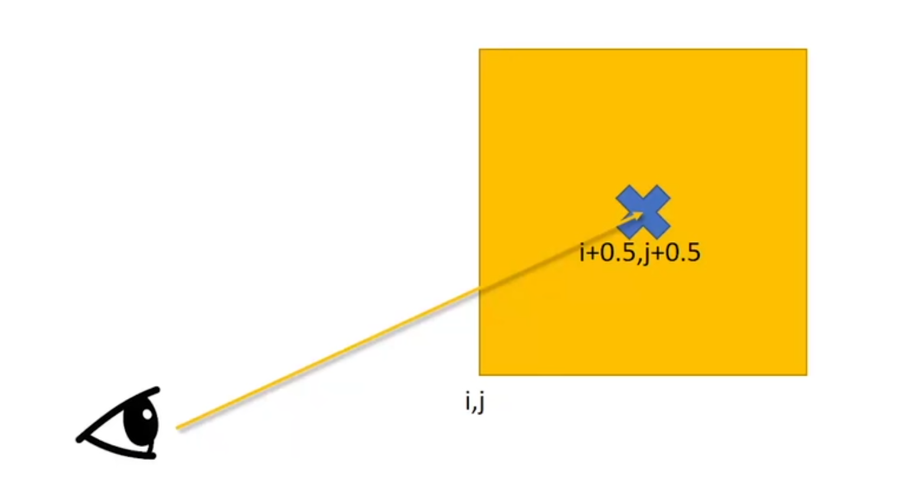

## 光线投射

我们要怎样把我们的光线从眼睛里放出去

### 定义射线

* 起点+方向
    $P=O+t\overrightarrow{d}$

* 起点+一个经过的点
    $\overrightarrow{d}=\frac{P-O}{|P-O|}$

### 放入摄像机

要定义的量

* lookFrom[None]=[x,y,z]
    摄像机位置

* lookAt[None]=[x,y,z]
    摄像机看向的方向

### 放入屏幕

* 屏幕到相机的距离
    distance=1.0

* 屏幕围绕中心点的旋转  
    up[None]=[0.0,1.0,0.0]
    屏幕的正上方是朝上的

* 屏幕的大小
    theta=1.0/3.0*PI
    FOV

sizing the screen

```python
theta=1.0/3.0*PI
half_height=ti.tan(theta/2.0)*distance
half_width=aspect_ratio*half_height*distance
```

设置3个向量

```python
w=(lookfrom[None]-lookat[None]).normalized()
u=(up[None].cross(w)).normalized()
v=w.cross(u)
```



计算重要参数

```python
cam_lower+left_corner[None]=(lookfrom[None]-half_width*u-half_height*v-w)*distance
cam_horizontal[None]=2*half_width*u*distance
cam_vertical[None]=2*half_height*v*distance
```



### 射出光线



将和屏幕的交点移动到像素的正中间

```python
u=float(i+0.5)/res_x
v=float(j+0.5)/res_y
```



2024.2.23
