##  光追概念和基础

### 基本问题

这条光线看到的是什么颜色

#### option1:color

物体是什么颜色就画什么颜色

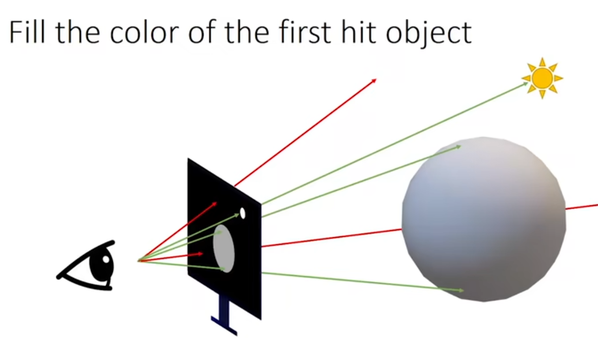

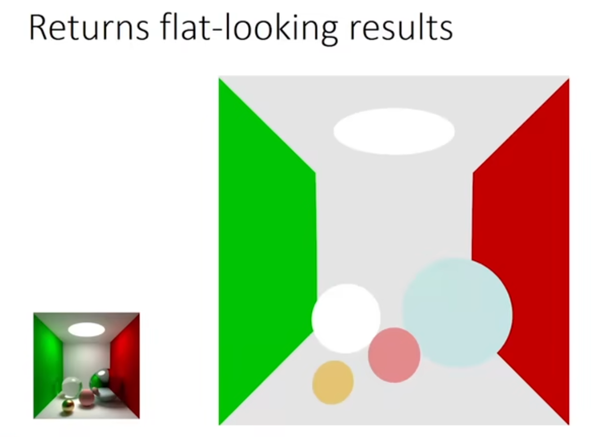

#### option2:color+shading

##### Lambertain reflectance model

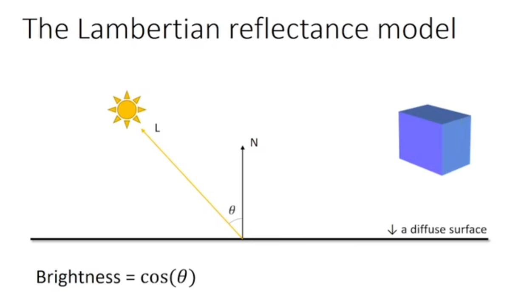

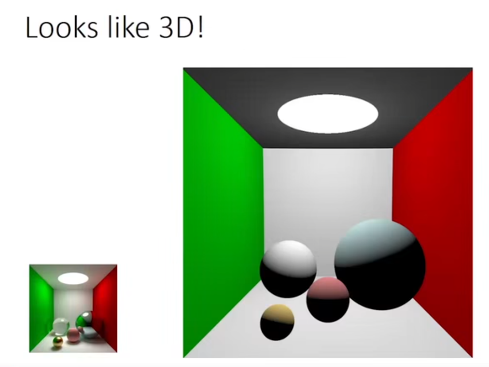

#### option3:blinn-phong model

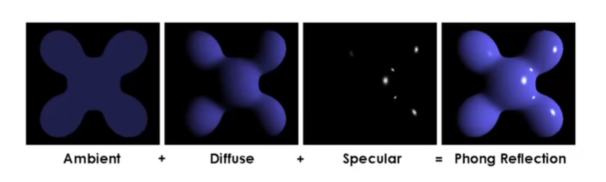

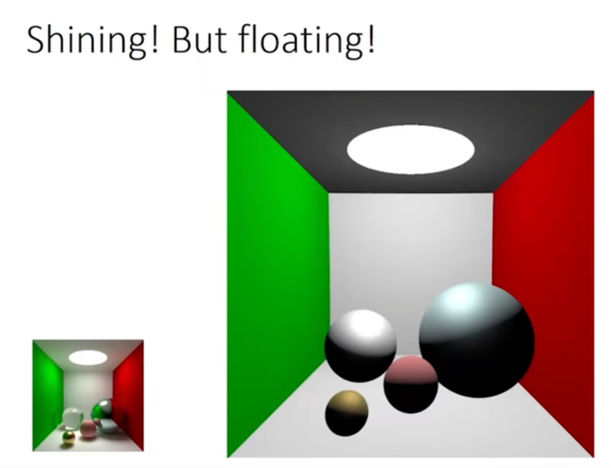

##### Phong reflectance model

计算高光

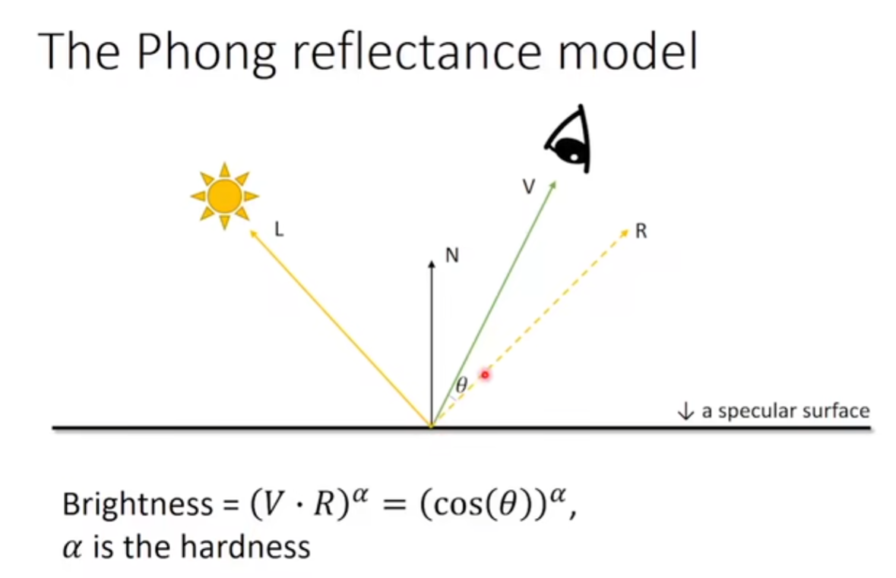

α控制高光亮点的大小

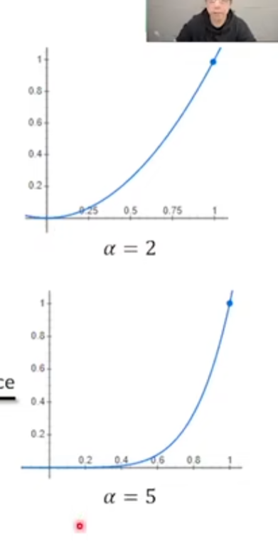

##### Blinn-Phong reflectance model

不用反射光线，而是用反射光线和入射光线的角平分线来进行计算

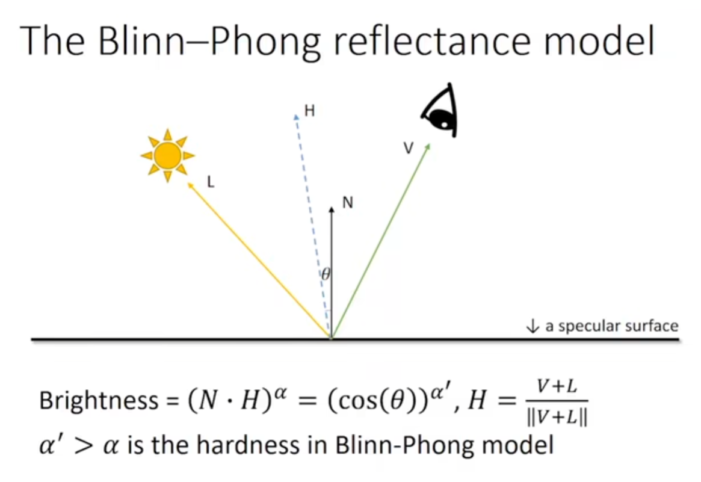

### option2.0:Whitted-style ray tracer

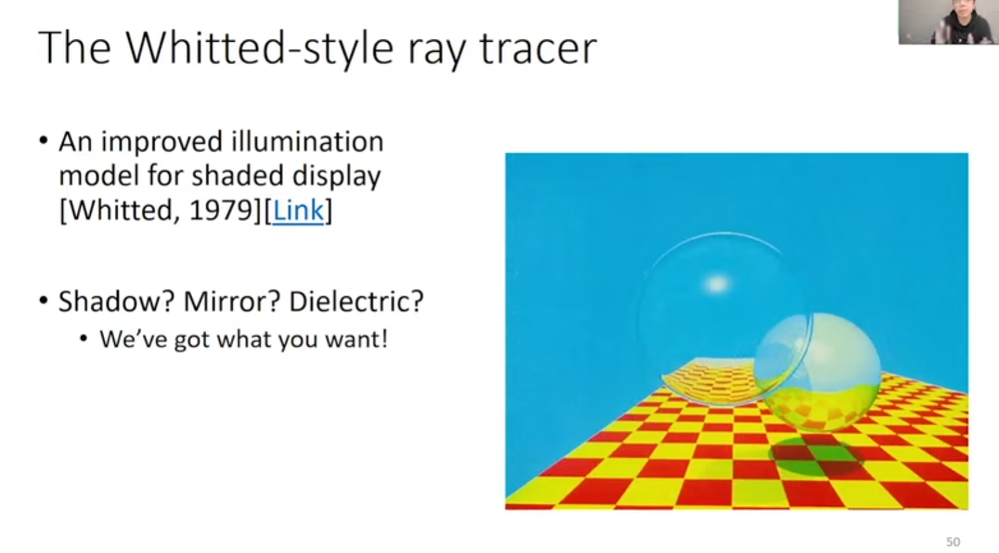

判断一条光线是否落在阴影中

如果光线打到的物体和光源之间的连线有阻隔，则认为在阴影中

否在，根据前面提到的模型计算shading

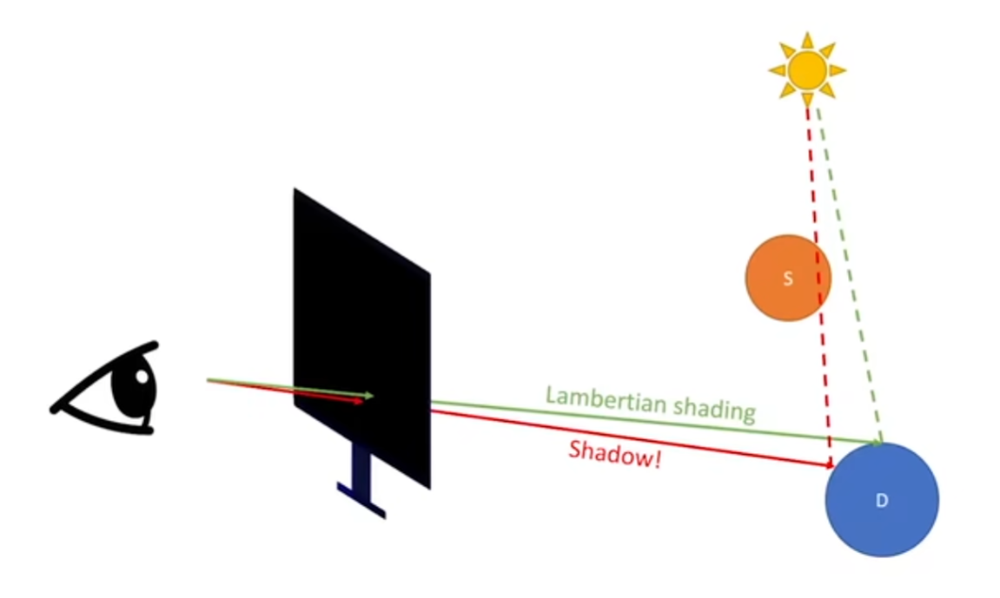

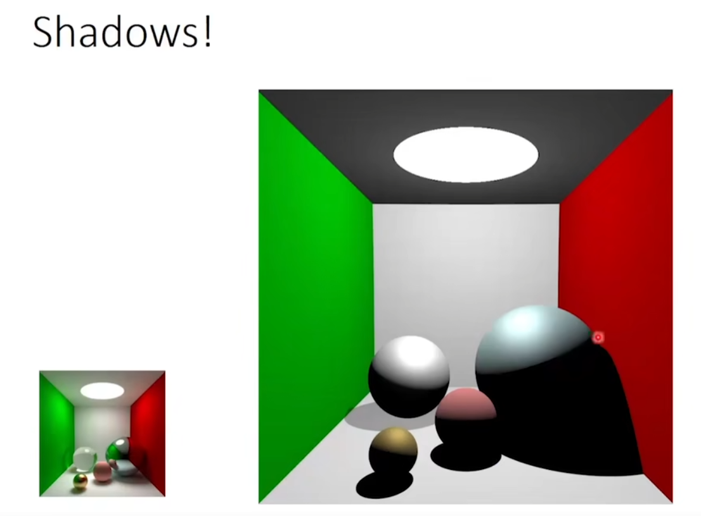

#### 加入反射光

当光线打到一个物体的时候，不立即返回颜色，而是计算反射光，去打别的物体

不同物体的颜色进行加权计算

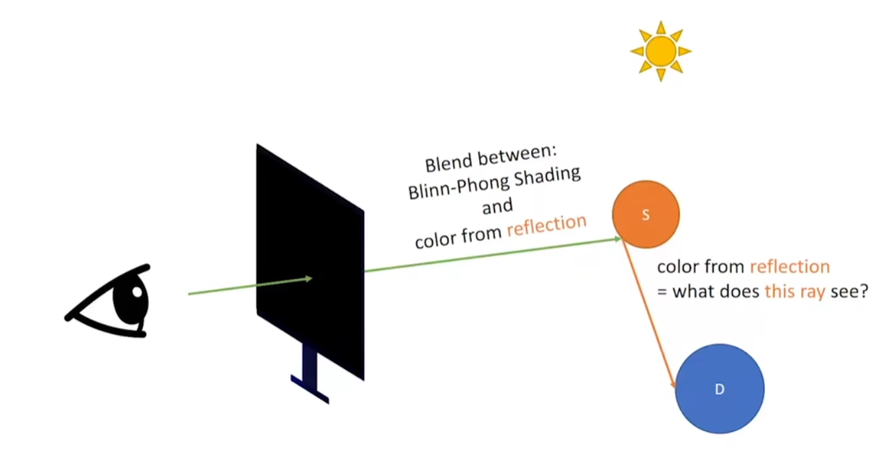

一个递归问题

#### 处理折射

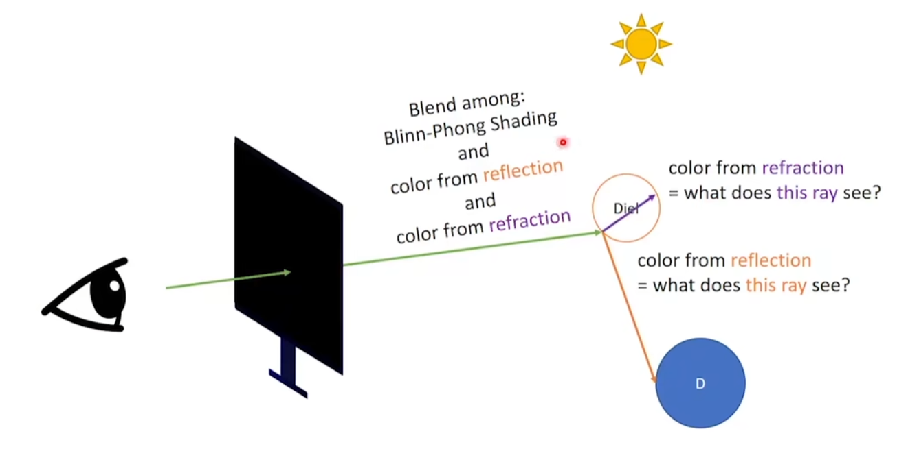

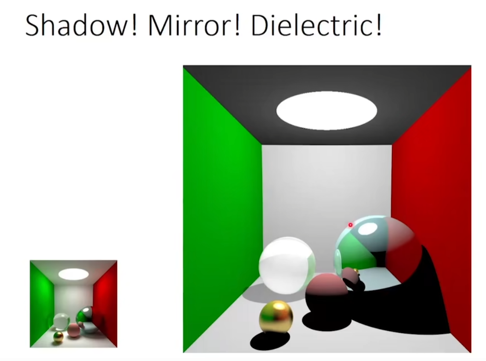

### option3.0:path tracer

从前面学到的

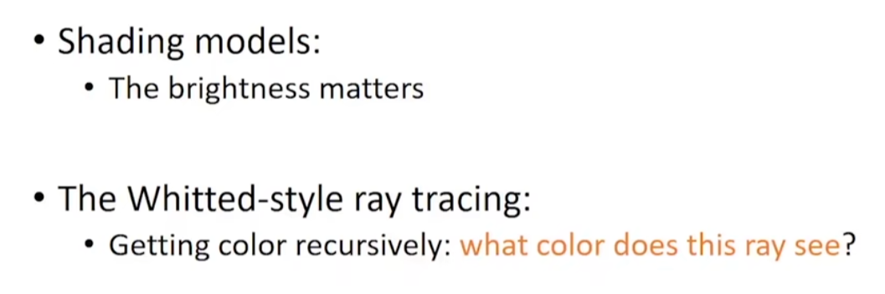

上述方法的缺陷：

假设宇宙的终点就是漫反射的表面，当光线打到漫反射表面的时候就不再弹了

#### 全局光照 global illumination(GI)

GI使得漫反射表面会继续反光给我

GI为开启的话，阴影纯黑

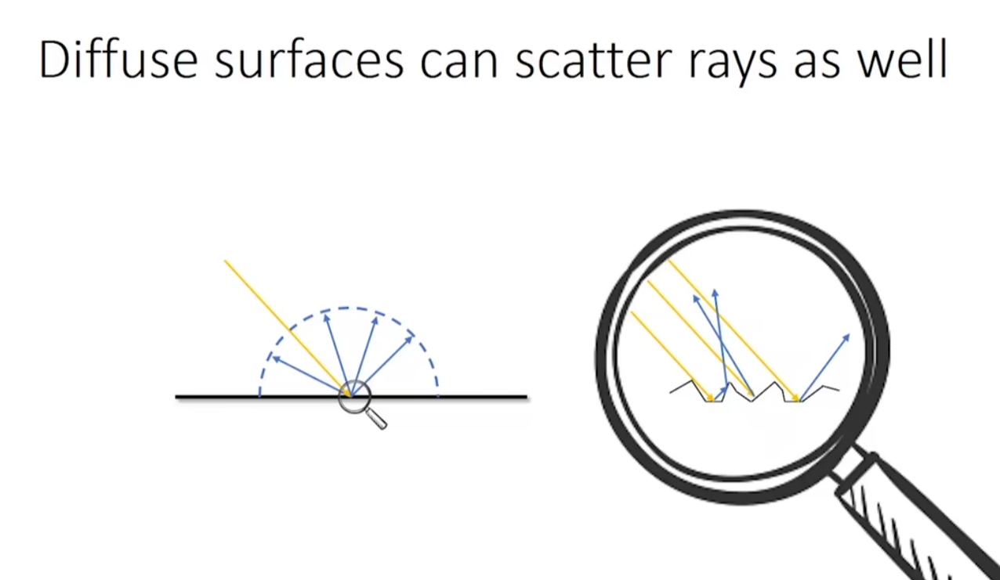

↓从统计的角度解决漫反射问题

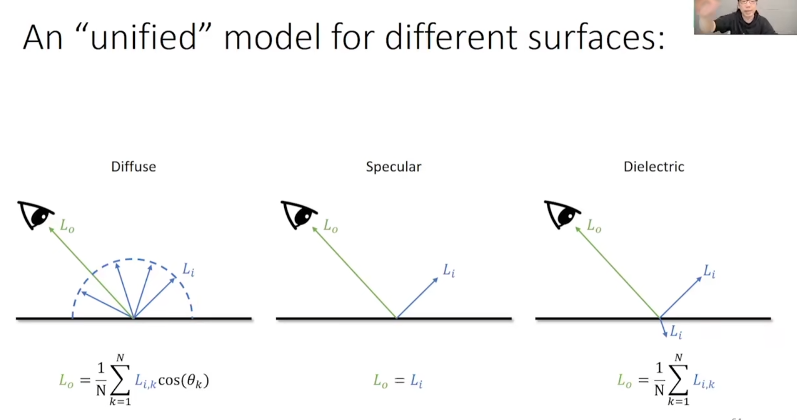

对于漫反射把四面八方来的光的颜色综合起来进行加权

2024.2.10
