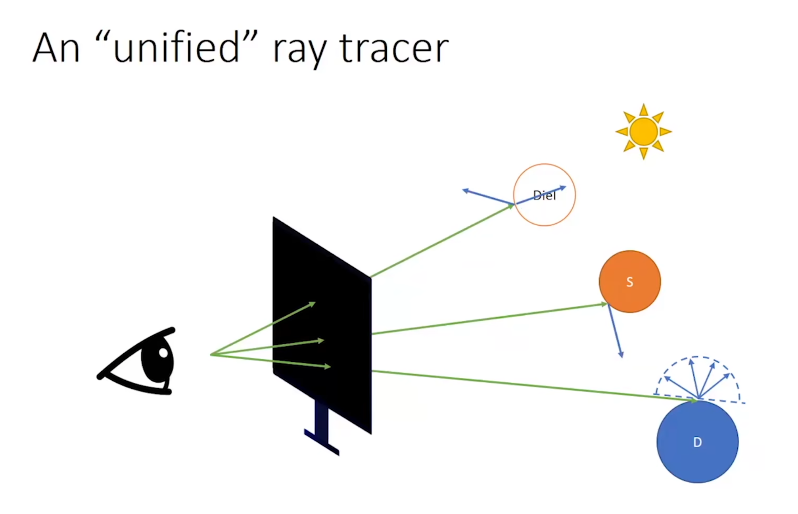
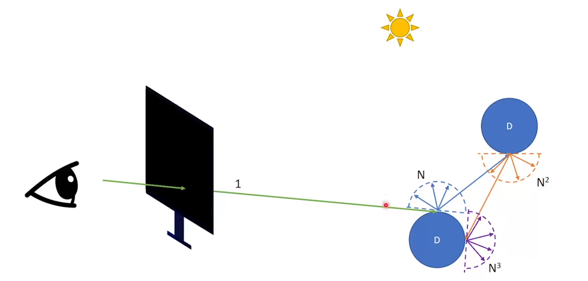
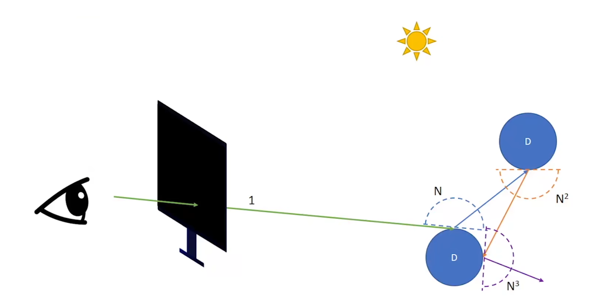
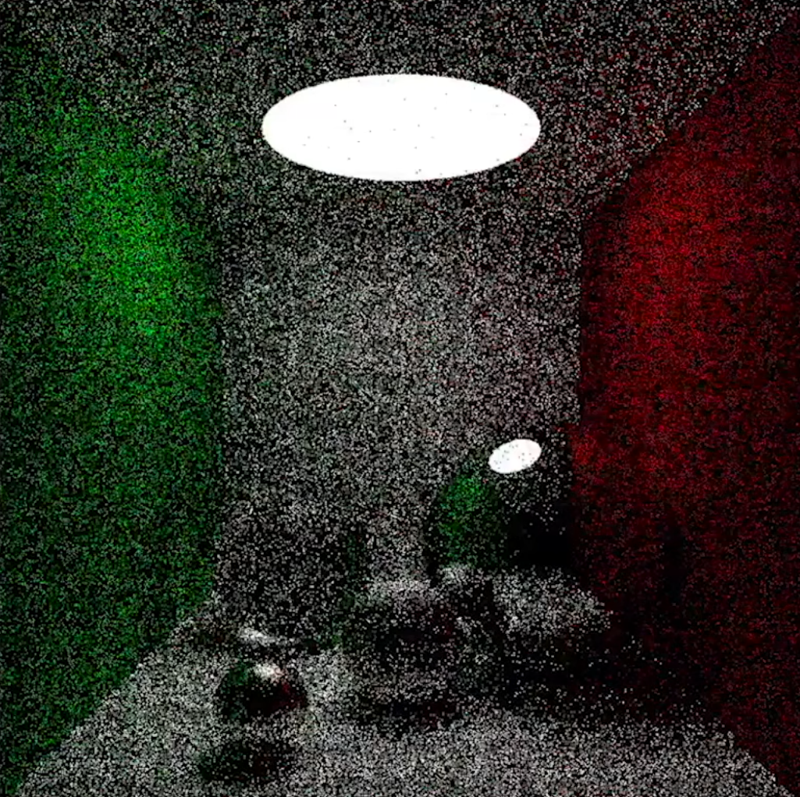
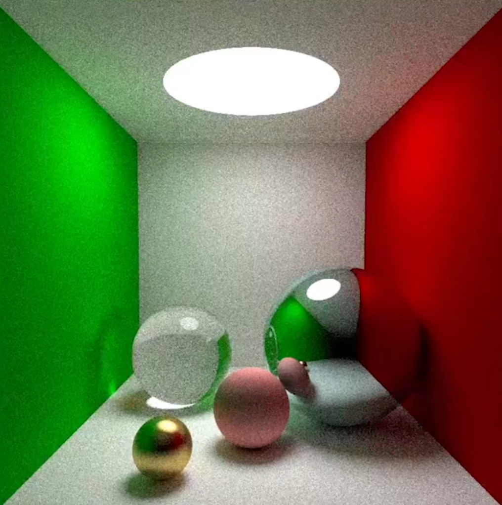
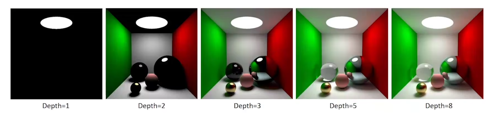
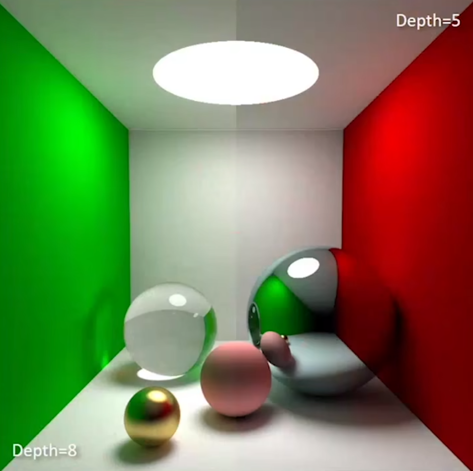
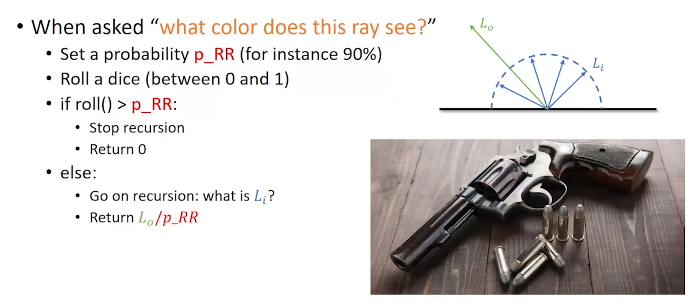
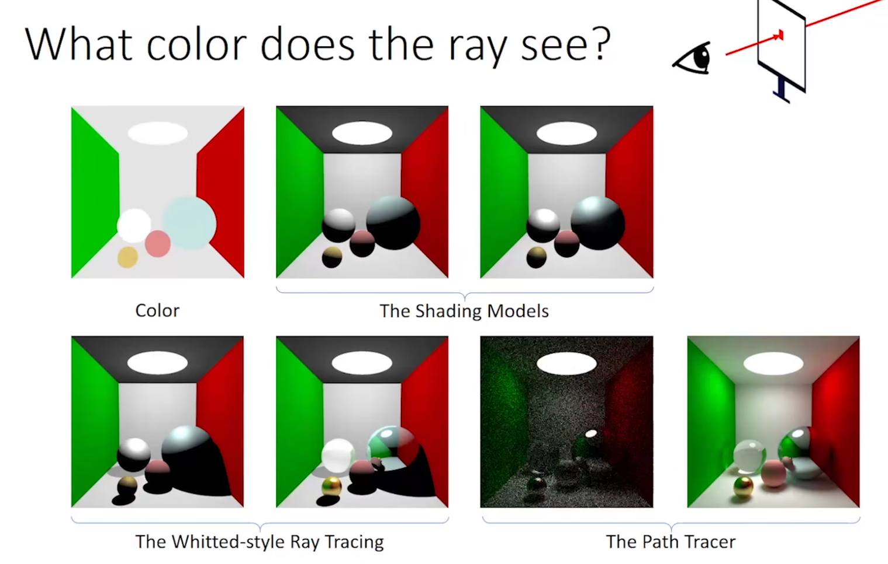

##  光追概念和基础

### 基本问题

这条光线看到的是什么颜色

#### option1:color

物体是什么颜色就画什么颜色


#### option2:color+shading


##### Lambertain reflectance model


#### option3:blinn-phong model


##### Phong reflectance model

计算高光


α控制高光亮点的大小


##### Blinn-Phong reflectance model

不用反射光线，而是用反射光线和入射光线的角平分线来进行计算


### option2.0:Whitted-style ray tracer


判断一条光线是否落在阴影中

如果光线打到的物体和光源之间的连线有阻隔，则认为在阴影中

否在，根据前面提到的模型计算shading


#### 加入反射光

当光线打到一个物体的时候，不立即返回颜色，而是计算反射光，去打别的物体

不同物体的颜色进行加权计算


一个递归问题

#### 处理折射


### option3.0:path tracer

从前面学到的


上述方法的缺陷：

假设宇宙的终点就是漫反射的表面，当光线打到漫反射表面的时候就不再弹了

#### 全局光照 global illumination(GI)

GI使得漫反射表面会继续反光给我

GI为开启的话，阴影纯黑


↓从统计的角度解决漫反射问题


对于漫反射把四面八方来的光的颜色综合起来进行加权，作为最终返回给我的颜色



##### 这种方法的问题

随着反射次数的增加，要追踪的光线数量会呈指数级增加



解决方法，取N=1

每次反射取随机一条光线进行追踪



不过这样会带来严重的噪声问题



解决方法：虽然不能让N变大，但是可以在一个像素上多次采样（增加SPP[sample per pixel]）

例如每个像素采样100次，然后平均起来，作为这个像素的颜色



##### 退出条件

* 追踪的光线碰到了光源

* 追踪的光线进入虚空

在这种情况下光线可能会在两个表面之间无限反弹，造成递归溢出

解决方法：

###### 限制光线弹射次数



允许的光线弹射次数越多，整体画面越亮



###### 俄罗斯轮盘赌

预设一个概率（比如90%），每次递归时进行一次概率计算，如果在概率范围内，则继续递归

否则就返回0（黑色）并停止递归



伪代码实现

```python
# 根据射线的起点和方向判断返回颜色
def what_color_dose_this_ray_see(ray_o,ray_dir):
    if(random()>p_RR):
        return 0
    else:
        flag,P,N,material=first_hit(ray_o,ray_dir,scene) # 第一个相交物体
        if flag==False:
            # 光线什么都没打到，进入虚空了
            return 0
        if material.type==LIGHT_SOURCE:
            # 打到光源
            return 1
        else:
            # 打到一个物体
            # 再生成一条光线进行递归
            ray2_o=P
            ray2_dir=scatter(ray_dir,P,N)

            L_i=what_color_dose_this_ray_see(ray2_o,ray2_dir)
            L_o=material.color*L_i/p_RR
            return L_o
```

### 总结



我们看到的颜色=颜色*亮度

我们看到的东西会反射很多次所以...

what we see=color*color*color*...*brightness

2024.2.10
2024.2.21
