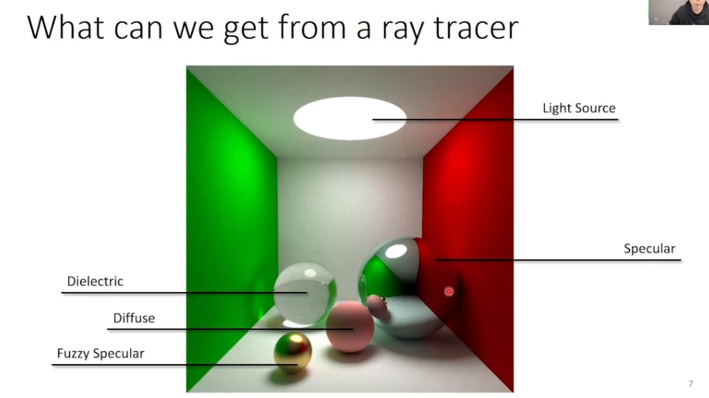
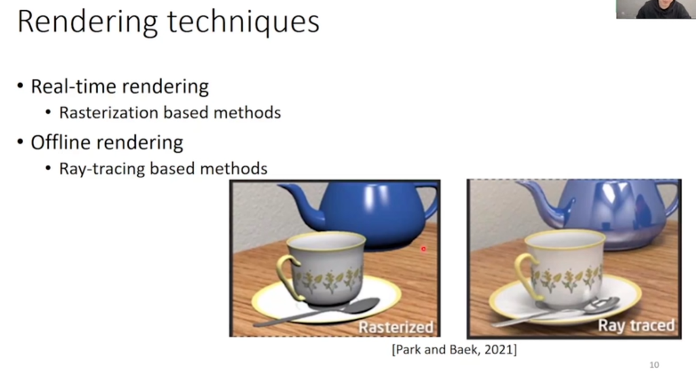
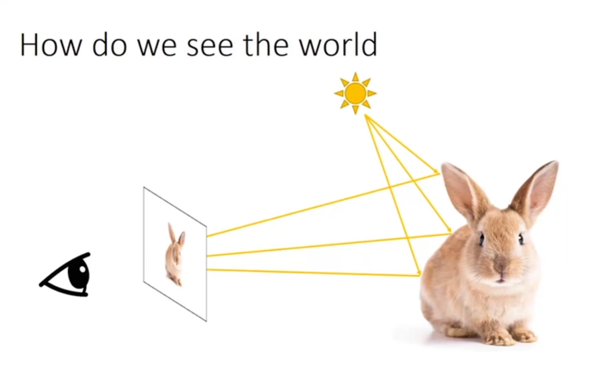
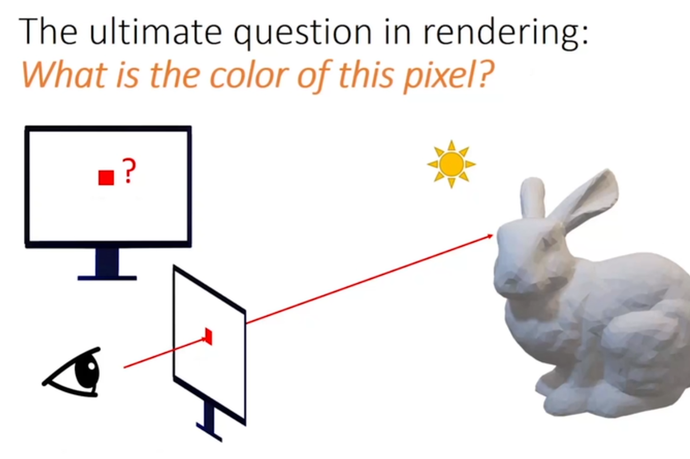

## 基本假设

我们需要做到什么





### 基本原理



### 基本假设

* 所有的光都走直线

* 光线不会互相干扰

* 光路可逆



```python
def color(ray_origin,ray_direction):
    col=ti.Vector([0.0,0.0,0.0])
    # do something
    return col
```

2024.2.10