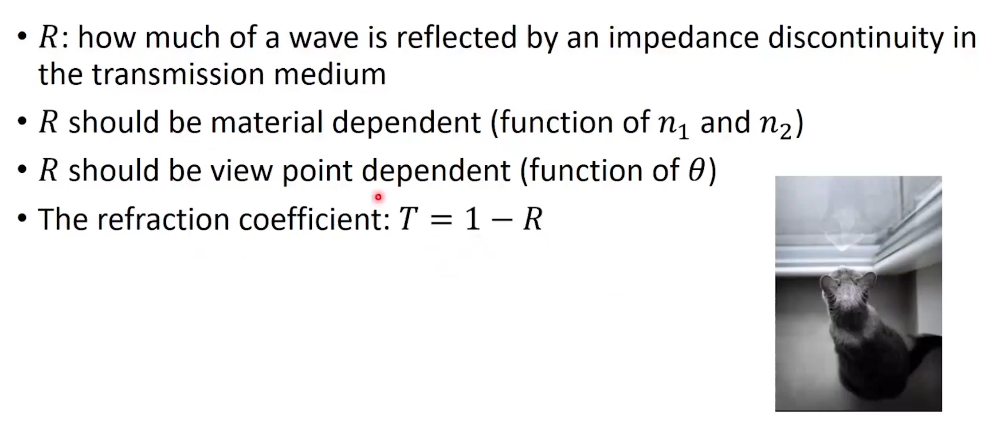

## 折射和反射


### 全反射


### 反射和折射的概率



#### 菲涅尔方程式

电磁学视角的折射和反射


#### 西里克近似

几何光学对菲涅尔方程式的近似


### 代码实现

```python
def scatter_on_a_dielectric_surface(I):
    sin_theta_i=-I.cross(N)
    theta_i=arcsin(sin_theta_i) # 入射角
    if n1/n2*sin_theta_i>1.0:
        return R # 全反射
    else:
        R_c=reflectance(theta_i,n1,n2)
        if random()<=R_c:
            return R # 反射
        else:
            return T # 折射
```


2024.2.24