## 随机采样

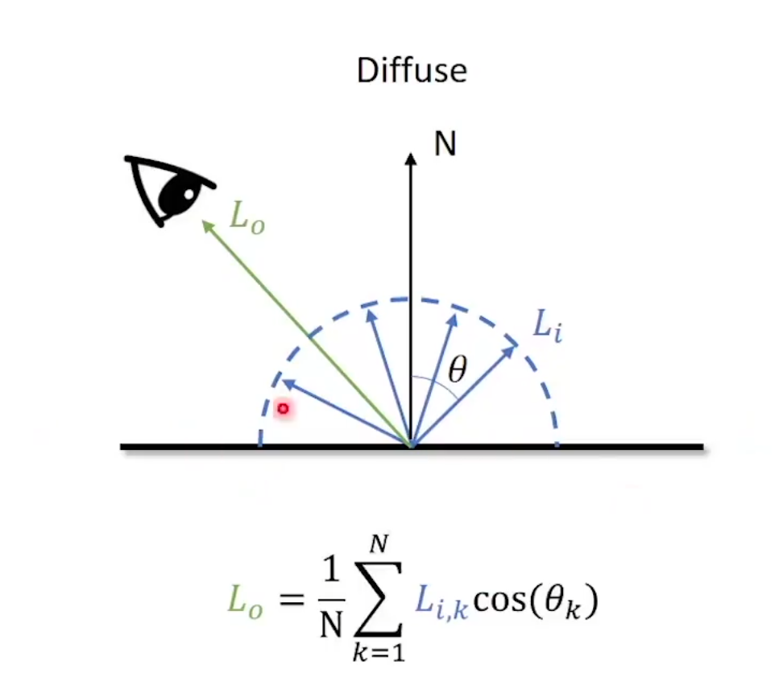

### 极坐标系和笛卡尔坐标系

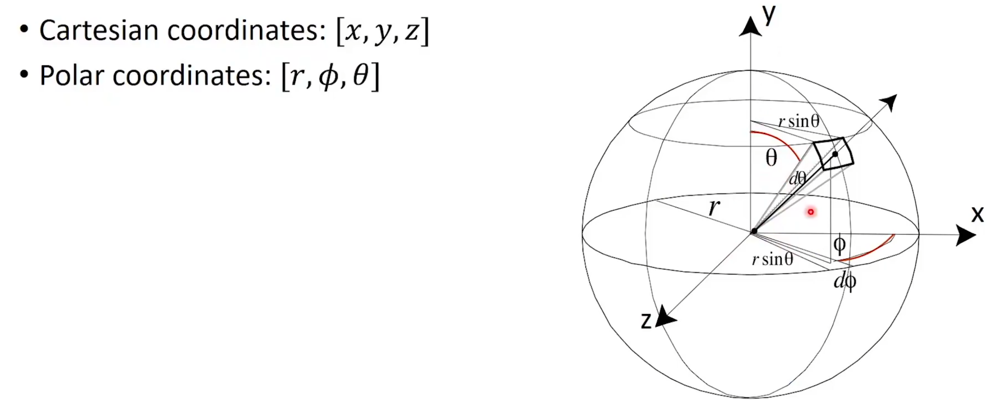

### 如何在球面上随机采样

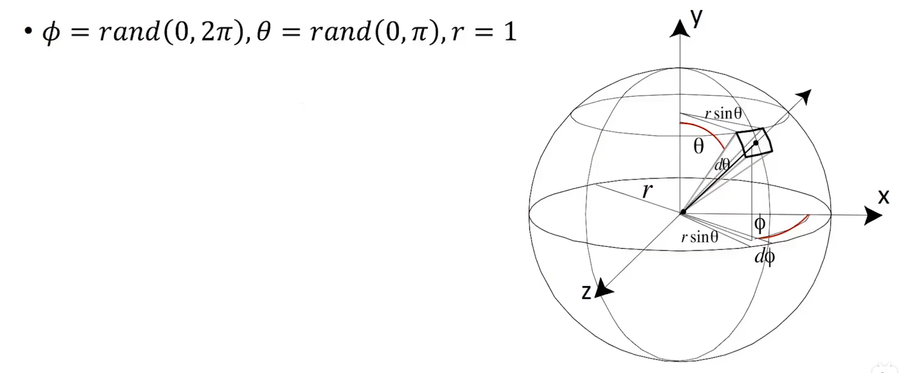

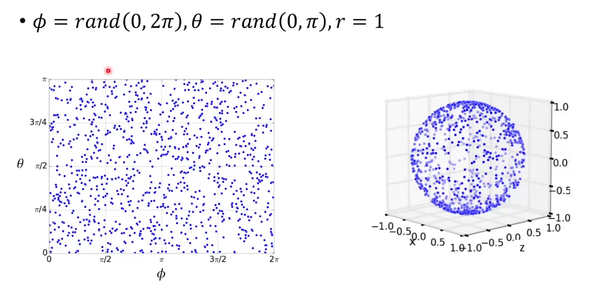

会造成两级的采样点特别多，赤道上比较少

#### 均匀的概念

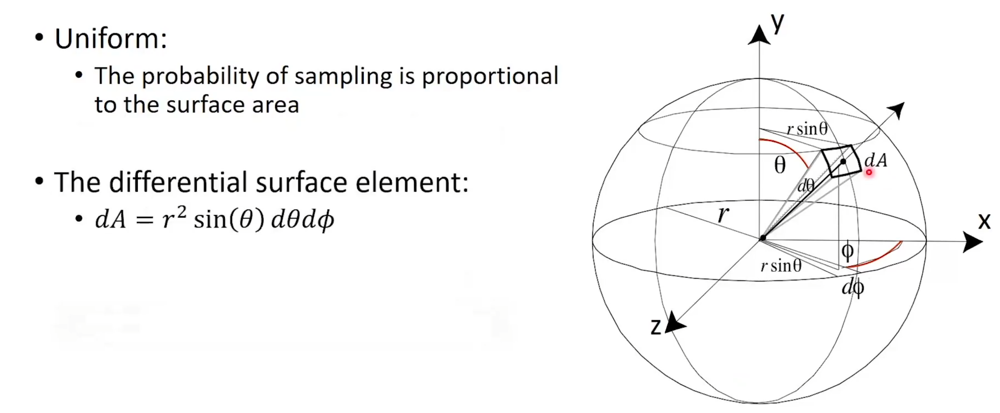

推导过程，可不看

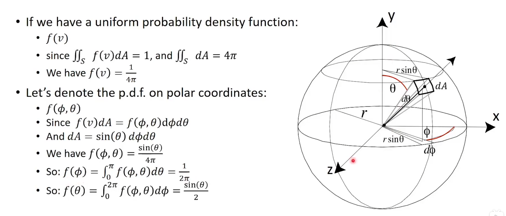

#### 最终的采样方法

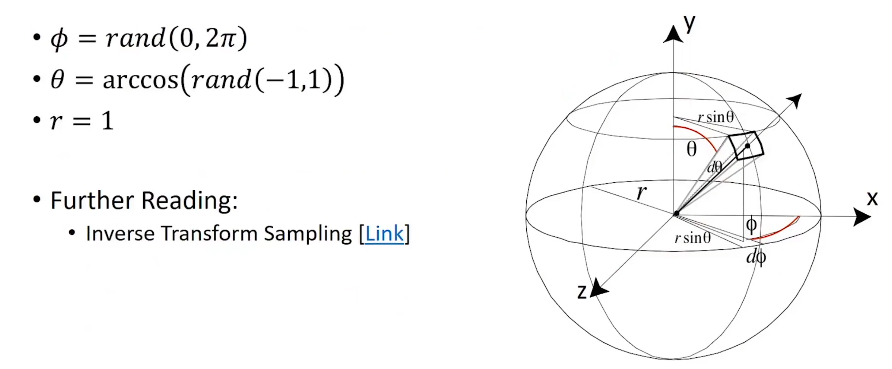

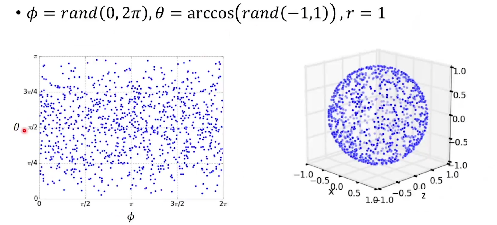

### 变换回笛卡尔坐标

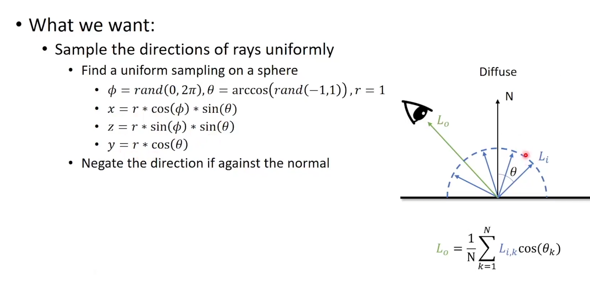

### 如何在球体内随机采样

* 基于概率论的方法
    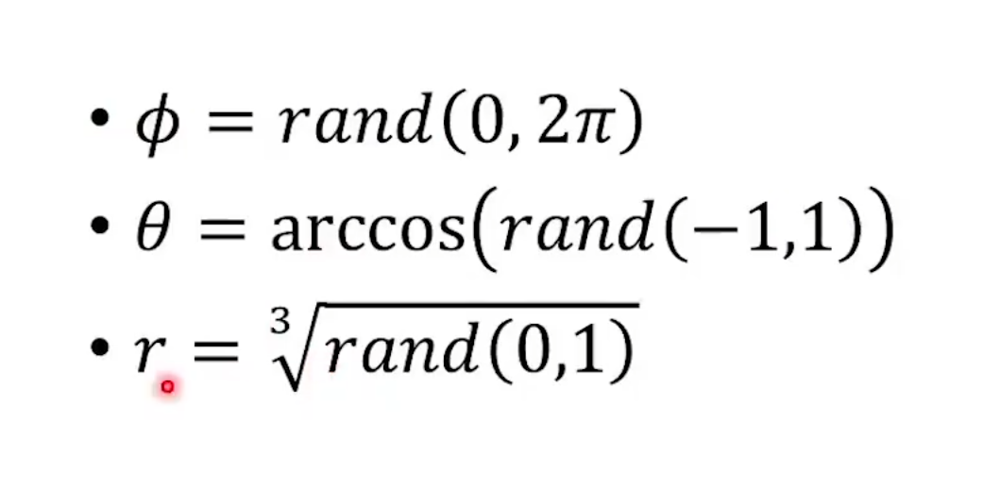

* 拒绝法   
    在球体的包围正方体中随机采样，排除掉球体外的部分
    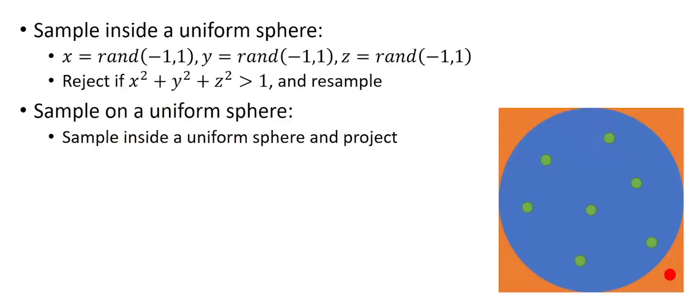
    缺点是随着维度的上升，拒绝率会越来越高

### 重要性采样

采样的结果和光线与发现的夹角θ有关

$L_o=\frac{1}{N}\sum^N_{k=1}L_{i,k}cos(\theta_k)$

采样N次后求平均值

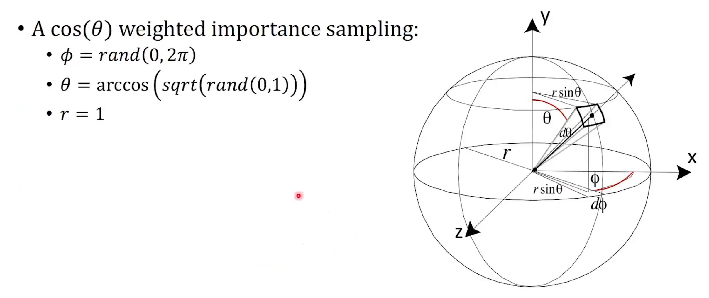

#### 单位圆法

以P为圆心做一个单位圆，在这个单位圆表面随机采样

再将采样的射线投影回原来的球面

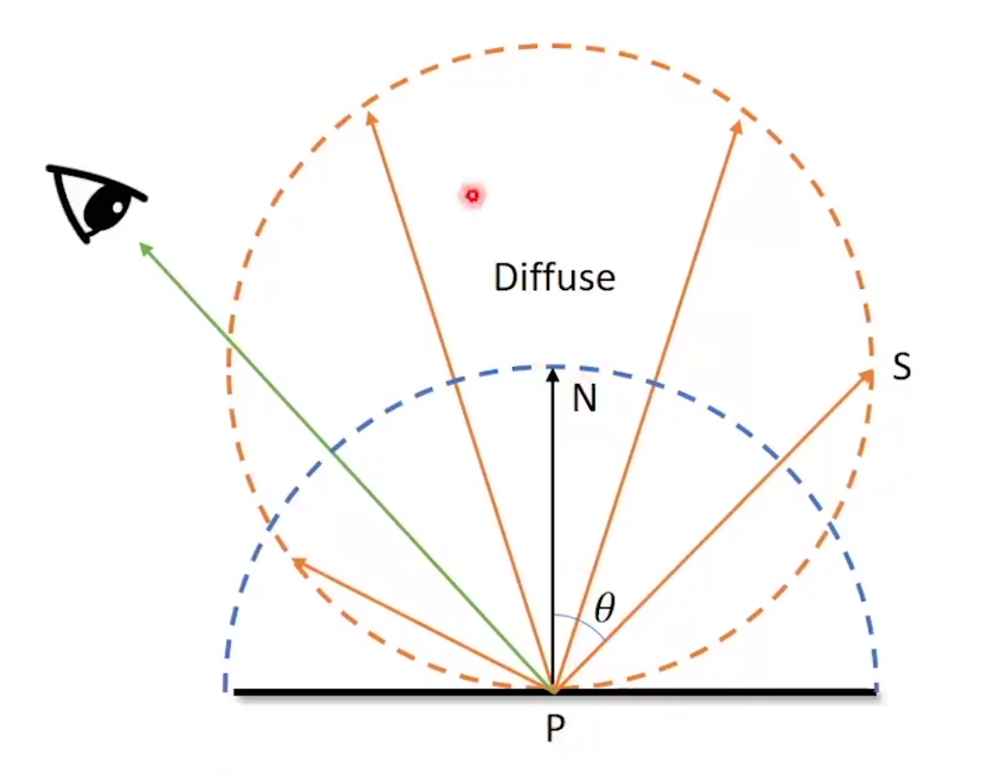

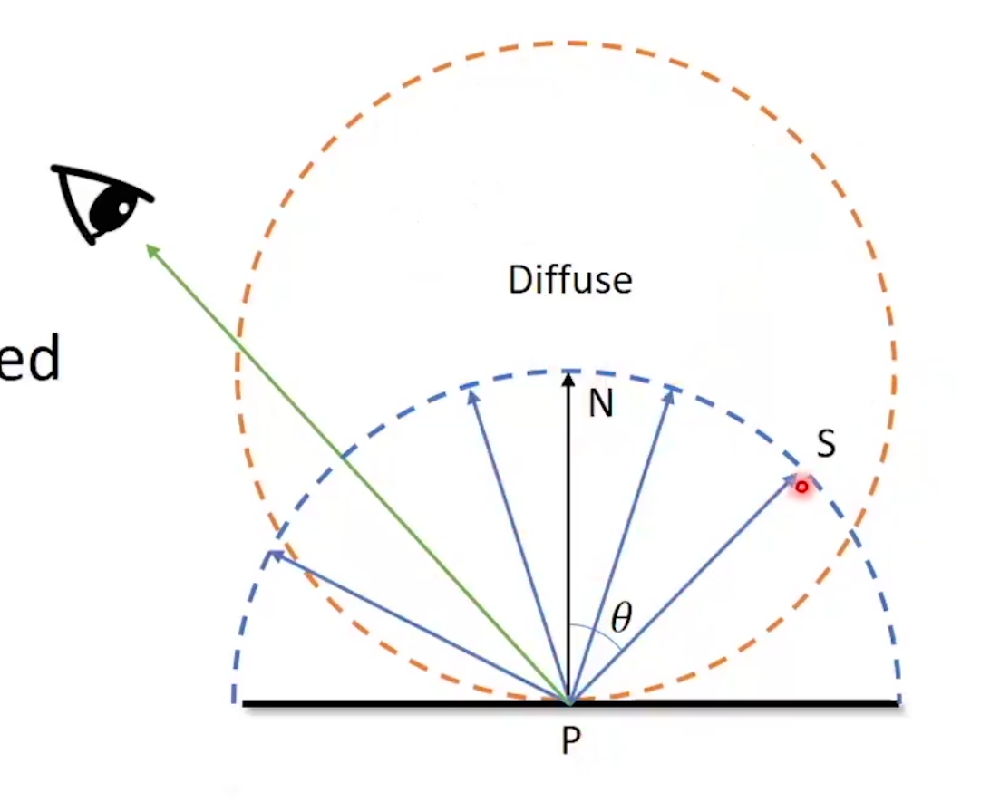

2024.2.24