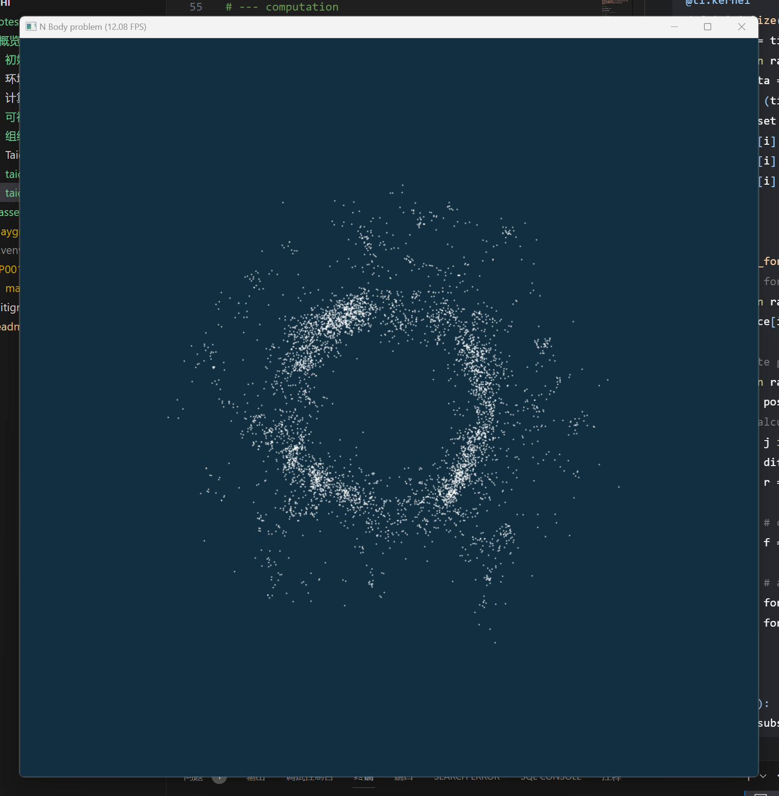

## HelloWorld

整个taichi程序可以分为
init data computation visualization四个部分

[代码文件](./../../playground/P001_HelloWorld/main.py)

```python
'''
powered by vezzzingQAQ
href:https://www.bilibili.com/video/BV1aL4y1a7pv/?p=9&spm_id_from=pageDriver&vd_source=aad093337a13638afc31f49e8d137e06
2024.2.3
'''

# --- init

import taichi as ti

ti.init(ti.gpu)

# --------------------------

# --- data

# global control
paused = ti.field(ti.i32, ())

# gravitational constant & pi
G = 1
PI = 3.141592653

# number of planets
N = 5000

# unit mass
m = 5
# glaxy_size
glaxy_size = 0.4
# planet_radius (for rendering)
planet_radius = 1.3
# initial velocity
init_vel = 120

# time-step size
h = 1e-5
# substepping
substepping = 10

# pos,vel and force of the planets
# Nx2 vectors
pos = ti.Vector.field(2, ti.f32, N)
vel = ti.Vector.field(2, ti.f32, N)
force = ti.Vector.field(2, ti.f32, N)

# --------------------------

# --- computation


@ti.kernel
def initialize():
    center = ti.Vector([0.5, 0.5])
    for i in range(N):
        theta = ti.random()*2*PI
        r = (ti.sqrt(ti.random())*0.7+0.3)*glaxy_size
        offset = r*ti.Vector([ti.cos(theta), ti.sin(theta)])
        pos[i] = center+offset
        vel[i] = [-offset.y, offset.x]
        vel[i] *= init_vel


@ti.kernel
def compute_force():
    # clear force
    for i in range(N):
        force[i] = ti.Vector([0.0, 0.0])

    # compute gravitational force
    for i in range(N):
        p = pos[i]
        # calculate force between each other
        for j in range(i):
            diff = p-pos[j]
            r = diff.norm(1e-5)

            # calculate g force
            f = -G*m*m*(1.0/r)**3*diff

            # asign to each particle
            force[i] += f
            force[j] += -f


@ti.kernel
def update():
    dt = h/substepping
    for i in range(N):
        vel[i] += dt*force[i]/m
        pos[i] += dt*vel[i]

# --------------------------

# --- visualization


gui = ti.GUI('N Body problem', (1024, 1024))

initialize()
while gui.running:

    for i in range(substepping):
        compute_force()
        update()

    gui.clear(0x112F41)
    gui.circles(pos.to_numpy(), color=0xffffff, radius=planet_radius)
    gui.show()
```



2024.2.3