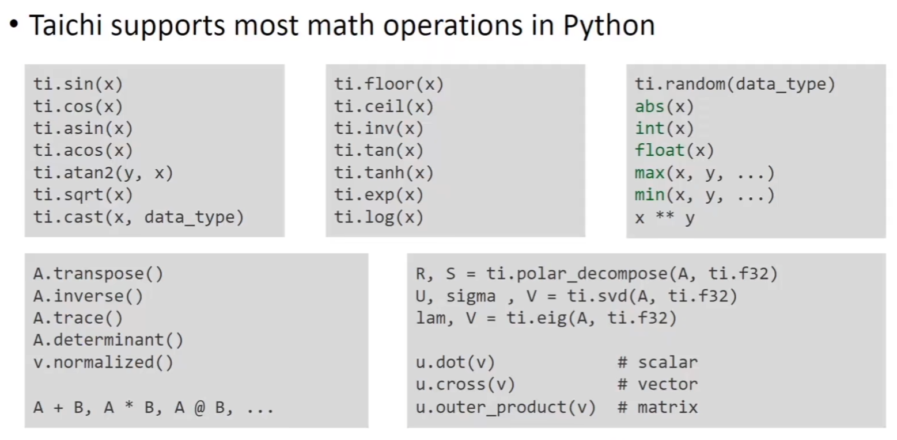

## 计算核

### ti.kernel

被@ti.kernel修饰的python函数

会被taichi编译成高性能的算法

kernel函数只能被python作用域调用，不能在一个kernel中调用另一个kernel函数

```python
import taichi as ti

ti.init(arch=ti.cpu)

def foo():
    print('foo')
    bar()

@ti.kernel
def bar():
    print('bar')

foo()
```

ti.kernel函数的执行效率要比传统python的效率快得多得多

#### 外层for优化

taichi会对kernel函数中最外层的for循环进行并行优化

```python
@ti.kernel
def fill():
    for i in range(10): # 并行优化
        x[i]+=i
        s=0
        for j in range(5): # 不并行优化
            ......
```

当我们希望对内层for循环进行并行处理时...

↓比如这种情况

```python
def my_for_loop():
    for i in range(10): # 这个不要并行
        for j in range(100): # 希望并行这个
            ......

my_for_loop()
```

可以进行如下优化，让ti.kernel修饰需要并行优化的for循环

```python
def my_for_loop():
    for i in range(10):
        my_taichi_for()

@ti.kernel
def my_taichi_for():
    for j in range(100):
        ......

my_for_loop()
```

#### break可用性

由于taichi对最外层for进行并行优化，最外层for循环中，break不可用

```python
@ti.kernel
def foo():
    for i in range(10):
        # 这里不能break
        for j in range(10):
            # 这里可以break
            break
```

#### data race问题

最外层for循环中，存在数据征用问题 [for循环中的两个分支同时要写入]，taichi会对+=进行特殊处理 [原子化保护] ，是可以用的，写开就不行了

```python
@ti.kernel
def sum():
    for i in range(10):
        total[None]+=x[i] # OK
        total[None]=total[None]+x[i] # data race
```

#### loop中的taichi.field

在最外层循环中可以直接对field进行loop

```python
import taichi as ti

ti.init(arch=ti.cpu)

N=10
x=ti.Vector.field(2,dtype=ti.i32,shape=(N,N))

@ti.kernel
def foo():
    for i,j in x:
        x[i,j]=ti.Vector([i,j])

foo()
```

#### kernel参数

* 目前最多支持8个参数

* 必须是type-hinted

```python
import taichi as ti

ti.init(arch=ti.cpu)

@ti.kernel
def my_kernel(x:ti.i32,y:ti.f32):
    print(x+y)

my_kernel(2,3.3)
```

* 只支持标量，ti.Vector需要拆开传递

```python
import taichi as ti

ti.init(arch=ti.cpu)

@ti.kernel
def foo(vx:ti.f32,vy:ti.f32):
    v=ti.Vector([vx,vy])
    ...
```

* 只能传值，传入时都会进行数据拷贝

#### 返回值

* 返回值不是必须的

* 返回值只能是一个type-hinted的标量

```python
import taichi as ti

ti.hint(arch=ti.cpu)

@ti.kernel
def my_kernel() -> ti.i32:
    return 233

print(my_kernel())
```

### ti.func

只能从ti.kernel中调用

```python
import taichi as ti

ti.init(arch=ti.cpu)

@ti.kernel
def foo():
    print('foo')
    bar()

@ti.func
def bar():
    print('bar')

foo()
```

* ti.func修饰的函数是强制内联的，不支持递归

* 由于ti.func被ti.kernel调用，因此不需要type-hinted

* 参数也是值传递，不能在函数中修改值

_如果一定要修改，就return出来_

```python
...
@ti.func(x):
def my_func(x):
    x=x+1
    return x

@ti.kernel
def my_kernel():
    x=233
    y=my_func(x)
```

### taichi scope

所有在@ti.kernel和@ti.func中的东西都处于taichi scope中

* taichi scope中类型是静态的

* taichi scope中的作用域也是静态的

```python
import taichi as ti

ti.init(arch=ti.cpu)

@ti.kernel
def err_out_of_scope(x:float):
    if x<0:
        y=-x
    else:
        y=x
    print(y) # 这里会报错，y不在这个作用域内，y已经被释放了

err_out_of_scope(10.0)
```

### 定义global参数

```python
import taichi as ti

ti.init(arch=ti.cpu)

a=42

@ti.kernel
def print_a():
    print('a=',a)

print_a() # a=42

a=53

print('a=',a) # a=53
print_a() # a=42
```

↑第一次调用print_a的时候a已经被编译成taichi的静态变量了

如果需要全局变量[python scope和taichi scope通用]，只能用field

```python
import taichi as ti

ti.init(arch=ti.cpu)

a=ti.field(ti.i32,shape=())

@ti.kernel
def print_a():
    print('a=',a[None])

a[None]=42
print_a() # a=42
a[None]=53
print_a() # a=53
```

### 数学运算



### 例子 N体仿真

```python
@ti.kernel
def initialize():
    center=ti.Vector([0.5,0.5])
    for i in range(N):
        theta=ti.random()*2*PI
        r=(ti.sqrt(ti.random())*0.7+0.3)*glaxy_size
        offset=r*ti.Vector([ti.cos(theta),ti.sin(theta)])
        pos[i]=center+offset
        vel[i]=[-offset.y,offset.x]
        vel[i]*=init_vel
```

```python
@ti.kernel
def update():
    dt=h/substepping
    for i in range(N):
        vel[i]+=dt*force[i]/m
        pos[i]+=dt*vel[i]
```

```python
@ti.kernel
def compute_force():
    # clear force
    for i in range(N):
        force[i]=ti.Vector([0.0,0.0])

    # compute gravitational force
    for i in range(N):
        p=pos[i]
        for j in range(N):
            if i!=j:
                diff=p-pos[j]
                r=diff.norm(1e-5)

                # gravitational force
                f=-G*m*m*(1.0/r)**3*diff

                # asign to each particle
                force[i]+=f
```

```python
initialize()
while gui.running:
    for i in range(substepping):
        compute_force()
        update()
    ...
```

2024.2.3
