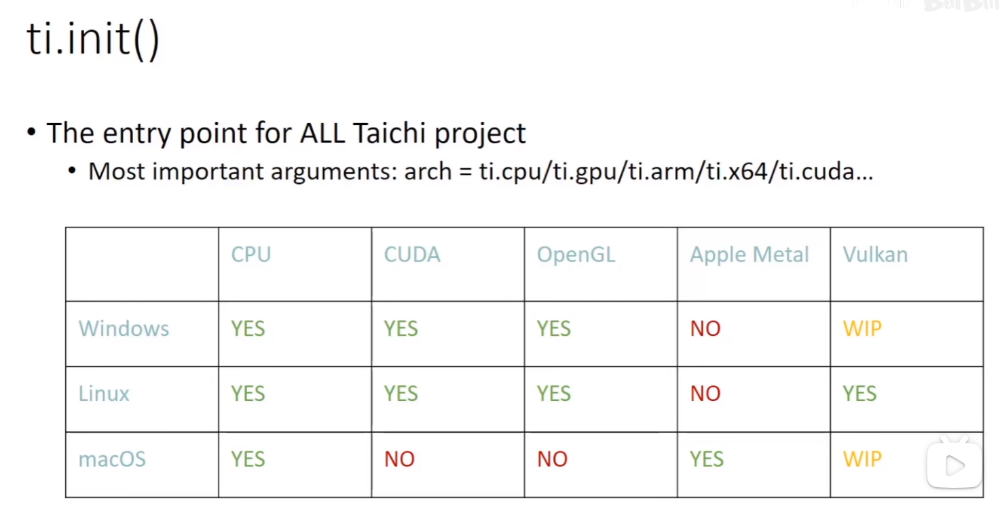
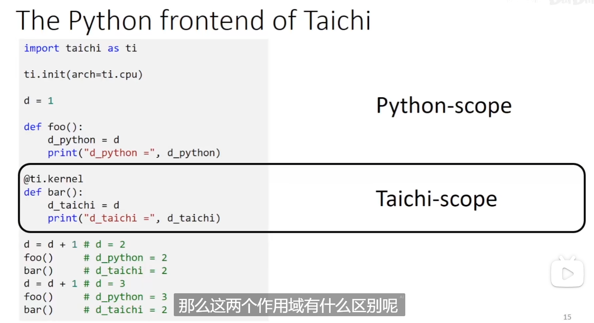
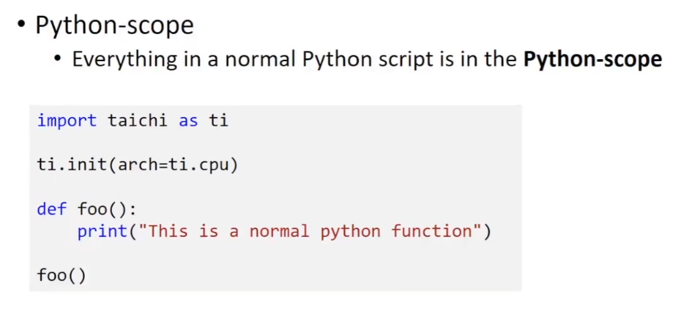
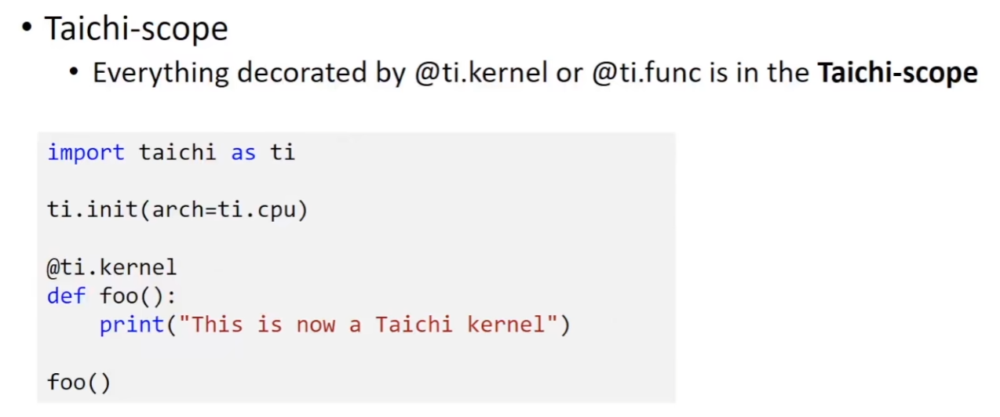

## 初始化

```python
import taichi as ti
ti.init(arch=ti.gpu)
```

### ti.init()



### python scope & taichi scope



python-scope中就是常规python代码

### python scope



### taichi scope



被@ti.kernel或者@ti.func修饰的函数

2024.2.2
