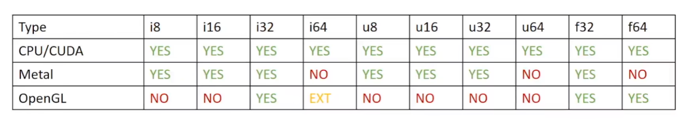
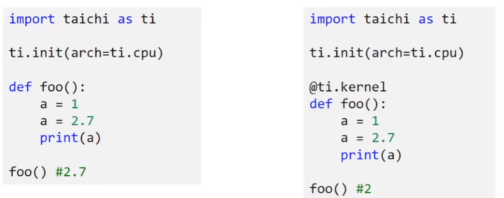

## 组织数据

### taichi数据类型

* signed integers:ti.i8, ti.i16, ti.i32, ti.i64

* unsigned integers:ti.u8, ti.u16, ti.u32, ti.u64

* float points:ti.f32, ti.f64

taichi的默认整型是ti.i32, taichi的默认浮点型是ti.f32



#### 类型转换

i32 + i32 = i32

i32 + i64 = i64

#### 隐式转换



左边的是原生python代码，定义变量后可以翻脸不认人，随意改变数据类型

右边的taichi代码就不行，会对赋进去的值进行隐式转换

#### 显式转换

ti.cast(variable, type)

```python
import taichi as ti

ti.init(arch=ti.cpu)

@ti.kernel
def foo():
    a=1.7
    b=ti.cast(a,ti.i32)
```

#### 复合类型

vector/matrix/struct

ti.types()

```python
import taichi as ti

ti.init(arch=ti.cpu)

vec3f=ti.types.vector(3,ti.f32)
mat2f=ti.types.matrix(2,2,ti.f32)
ray=ti.types.struct(ro=vec3f,rd=vec3f,l=ti.f32)

@ti.kernel
def foo():
    a=vec3f(0.0)
    d=vec3f(0.0,1.0,0.0)
    b=mat2f([[1.5,1.4],[1.3,1.2]])
    r=ray(ro=a,rd=d,l=1)
```

taichi也预定义了一些常用的复合类型

ti. Vector, ti. Matrix, ti. Struct

```python
import taichi as ti

ti.init(arch=ti.cpu)

@ti.kernel
def foo():
    a=ti.Vector([0.0,0.0,0.0])
    d=ti.Vector([0.0,1.0,0.0])
    d.ti.Matrix([[1.5,1.4,1.3,1.2]])
    r=ti.Struct(v1=a,v2=d,l=1)
```

访问向量的属性

```python
a=ti.Vector([1.0,2.0,3.0])
a[1]
```

### ti.field

表示场

例如一个锅上面等分点的温度数据

```python
heat_field=ti.field(dtype=ti.f32,shape=(256,256))
```

是一个N维的数组

可以被taichi或者python scope调用，是一个**全局**的变量

里面的element可以是数据, vector, matrix或者struct

#### 访问field元素

```python
import taichi as ti

ti.init(arch=ti.cpu)

pixels=ti.field(dtype=float,shape=(6,8))
pixels[1,2]=42.0
```

```python
import taichi as ti

ti.init(arch=ti.cpu)

vf=ti.Vector.field(3,ti.f32,shape=4)

@ti.kernel
def foo():
    v=ti.Vector([1,2,3])
    vf[0]=v
```

#### field的一些例子

3D Gravitational Field in a 256x256x256 Room

```python
gravitational_field=ti.Vector.field(n=3,dtype=ti.f32,shape=(256,256,256))
```

2D Strain-tensor Field in a 64x64 Grid [二维形变向量场]

```python
strain_tensor_field=ti.Matrix.field(n=2,m=2,dtype=ti.f32,shape=(64,64))
```

a Global Scalar that I Want to Access in a Taichi Kernel

```python
global_scalar=ti.field(dtype=ti.f32,shape=())
```

### 例子：N体系统

```python
G=1
PI=3.141592653

# number of planets
N=300
# unit mass
m=5
galaxy_size=0.4
planet_radius=2
init_vel=120

# time-step size
h=1e-5
# substepping
substepping=10

# pos,vel and force of the planets
pos=ti.Vector.field(2,ti.f32,N)
vel=ti.Vector.field(2,ti.f32,N)
force=ti.Vector.field(2,ti.f32,N)
```

2024.2.2
