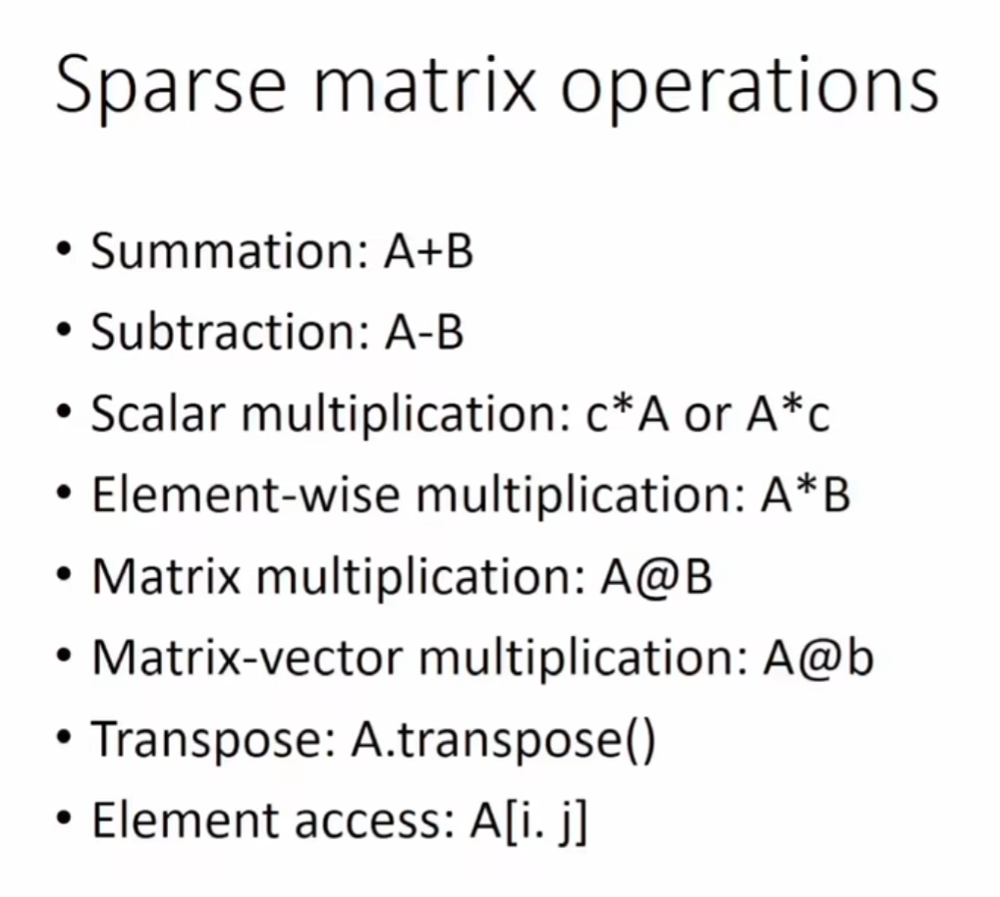
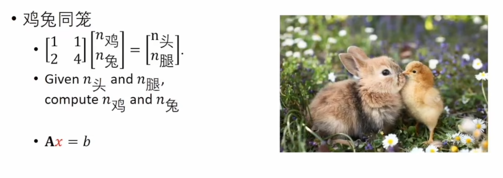
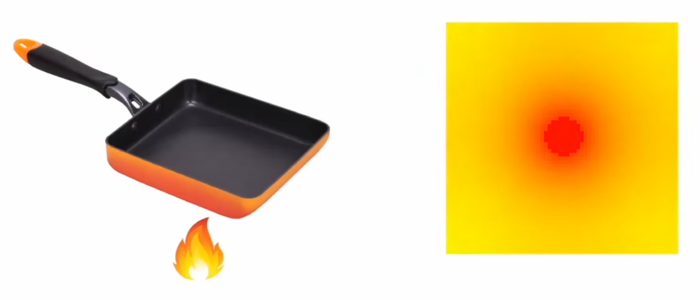
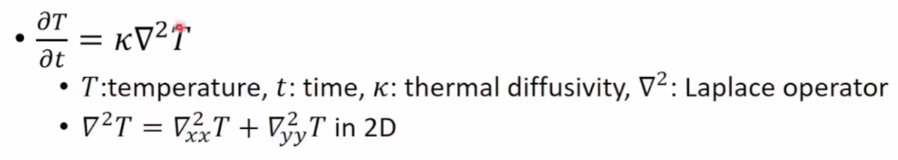
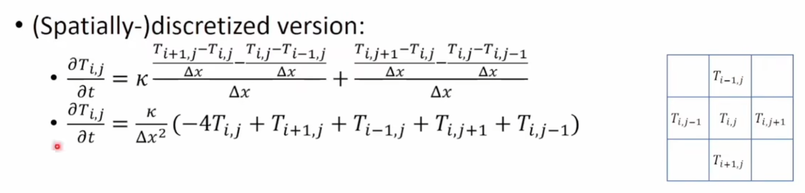
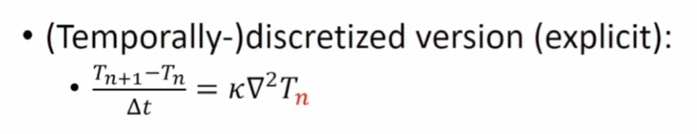
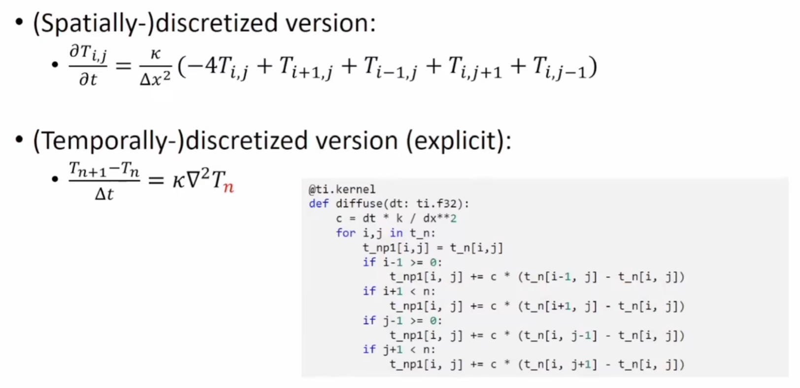
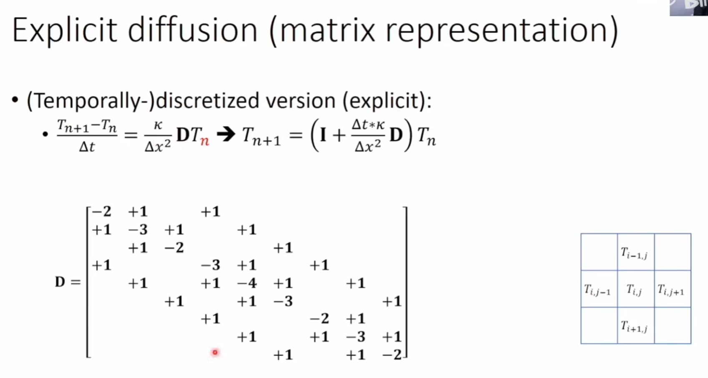

## 稀疏矩阵

taichi是一个面向数据的语言

所有的taichi数据都是树状节点 (SNode)

### 构造稀疏矩阵

```python
n=4

# step1 create sparse matrix builder
K=ti.SparseMatrixBuilder(n,n,max_num_triplets)=100

# step2 fill the builder with data
@ti.kernel
def fill(A:ti.spares_matrix_builder()):
    for i in range(n):
        A[i,i]+=1
fill(K)

# step3 create a sparse matrix from the builder
A=K.build()
```

### 稀疏矩阵数学运算



### 稀疏线性求解器

#### 应用

鸡兔同笼问题



扩散问题













#### 使用

##### 构造

```python
solver=ti.SparseSolver(solver_type='LLT')
solver.analyze_pattern(A)
solver.factorize(A)
```

##### solve

```python
x=solver.solve(b) # b是一个ti.field或者numpy array
```

##### 检查求解是否成功

```python
isSuccessful=solver.info()
print(x)
```

2024.2.10