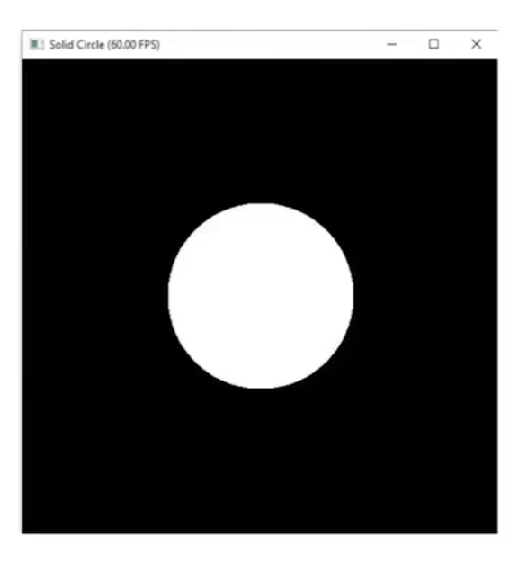
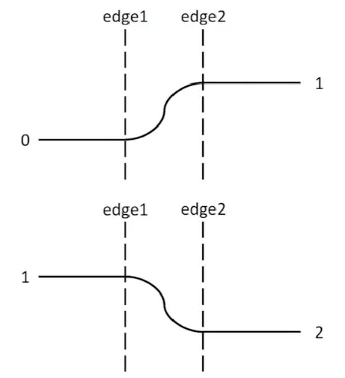
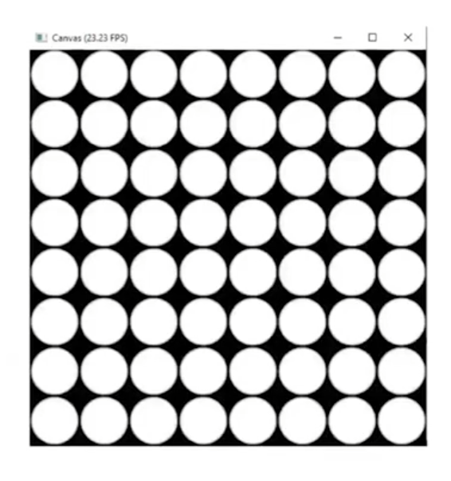

## 如何编写程序动画

https://github.com/taichiCourse01/--ShaderToys

### 代码链接

* [sin函数](./../../playground/P003_BasicAnimation/main.py)

* [分型圆](./../../playground/P003_BasicAnimation/main2.py)

* [shaderToy案例](./../../playground/P003_BasicAnimation/main3.py)

### steps

* setup your canvas
* put some colors on your canvas
* draw a basic unit
* repeat the basic units:tiles and fractals
* animate your pictures
* introduce some randomness(chaos!)

### 建立画布

```python
import taichi as ti
ti.init(arch=ti.cuda)

res_x=512
res_y=512
pixels=ti.Vector.field(3,ti.f32,shape=(res_x,res_y))

@ti.kernel
def render():
    # draw something on canvas
    for i,j in pixels:
        color=ti.Vector([0.0,0.0,0.0]) # init your canvas to black
        pixels[i,j]=color

gui=ti.GUI('canvas',res=(res_x,res_y))

for i in range(100000):
    render()
    gui.set_image(pixels)
    gui.show()
```

### 在画布上上色

```python
@ti.kernel
def render():
    # draw something on your canvas
    for i,j in pixels:
        r=0.5*ti.sin(float(i)/res_x)+0.5
        g=0.5*ti.sin(float(j)/res_y+2)+0.5
        b=0.5*ti.sin(float(i)/res_x+4)+0.5
        color=ti.Vector([r,g,b])
        pixels[i,j]=color
```

### 绘制基本形状

```python
@ti.kernel
def render(t:ti.f32):
    for i,j in pixels:
        color=ti.Vector([0.0,0.0,0.0])
        pos=ti.Vector([i,j])
        center=ti.Vector([res_x/2.0,res_y/2.0])
        r1=100.0
        r=(pos-center).norm()

        if r<r1:
            color=ti.Vector([1.0,1.0,1.0])
        
        pxiels[i,j]=color
```



#### linear step

线性插值

```python
@ti.func
def linearstep(edge1,edge2,v):
    assert(edge1!=edge2):
    t=(v-edge1)/float(edge2-edge1)
    t=clamp(t,0.0,1.0)
    return t
```


非线性插值

```python
@ti.func
def linearstep(edge1,edge2,v):
    assert(edge1!=edge2):
    t=(v-edge1)/float(edge2-edge1)
    t=clamp(t,0.0,1.0)
    return (3-2*t)*t**2
```




#### 带有插值的圆

```python
@ti.func
def circle(pos,center,radius,blur):
    r=(pos-center).norm()
    t=0.0
    if blur>1.0:blur=1.0
    if blur<=0.0:
        t=1.00-hsf.step(1.0,r/radius)
    else:
        t=hsf.smoothstep(1.0,1.0-blur,r/radius)
    return t

@ti.kernel
def render(t:ti.f32):
    for i,j in pixels:
        ...
        c=circle(pos,center,r1,0.1)
        color=ti.Vector([1.0,1.0,1.0])*c
        pixels[i,j]=color
```


### 重复 tiles

技巧：用mod进行取模


```python
@ti.kernel
def render(t:ti.f32):
    for i_,j_ in pixels:
        color=ti.Vector([0.0,0.0,0.0])

        tile_size=64

        i=ti.mod(i_,tile_size)
        j=ti.mod(j_,tile_size)

        pos=ti.Vector([i,j])
        center=ti.Vector([tile_size/2.0,tile_size/2.0])

        radius=tile_size/4.0

        c=circle(pos,center,radius,0.1)
        color=c*ti.Vector([0.0,0.0,1.0])

        pixels[i_,j_]=color
```



### 分型

```python
import taichi as ti
ti.init(arch=ti.cpu)

res_x = 64*12
res_y = 64*12
pixels = ti.Vector.field(3, ti.f32, shape=(res_x, res_y))

@ti.func
def circle(pos, center, radius: ti.f32):
    r = (pos-center).norm()
    val = 0.0
    if r < radius:
        val = 1.0
    return val

@ti.kernel
def render(t: ti.f32):
    # draw something on your canvas
    for i_, j_ in pixels:
        color = ti.Vector([0.0, 0.0, 0.0])

        tile_size = 4

        for k in range(7):
            i = i_-ti.floor(i_/tile_size)*tile_size
            j = j_-ti.floor(j_/tile_size)*tile_size
            
            pos = ti.Vector([i, j])
            center = ti.Vector([tile_size/2.0, tile_size/2.0])

            radius = tile_size/2.0
            c = circle(pos, center, radius)
            color += c*ti.Vector([1.0, 1.0, 1.0])

            color /= 3.0
            tile_size *= 2

        pixels[i_, j_] = color

@ti.func
def cal(x: ti.i32, y: ti.i32, t: ti.f32):
    z = 0.5*ti.sin(float(x*y*0.0001+t))+0.5
    return z

gui = ti.GUI('canvas', res=(res_x, res_y))

for i in range(100000):
    render(i*0.1)
    gui.set_image(pixels)
    gui.show()
```


### 引入随机

```python
y=rand(x)
y=ti.random()
```

ti.random是非连续的随机

#### 自己构造伪随机数


#### perlin noise


2024.2.10
