## 高级稀疏数据结构

### 为什么需要稀疏数据结构

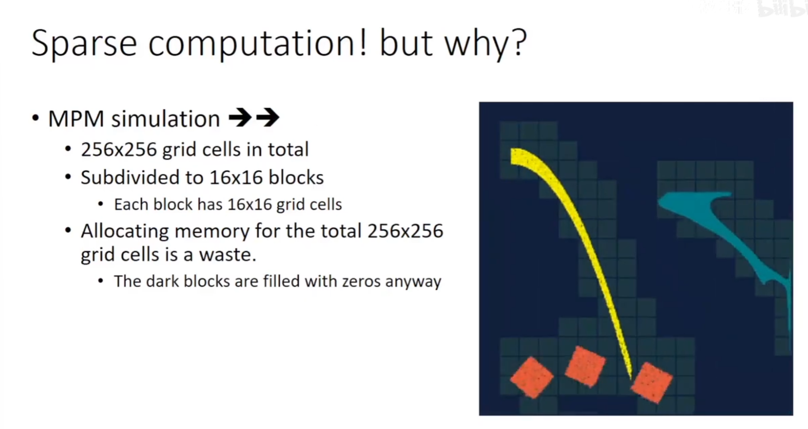

### HOW?

#### 稠密数据结构

```python
x=ti.field(ti.i32)
block1=ti.root.dense(ti.i,3)
block2=block1.dense(ti.j,3)
block2.palce(x)
```

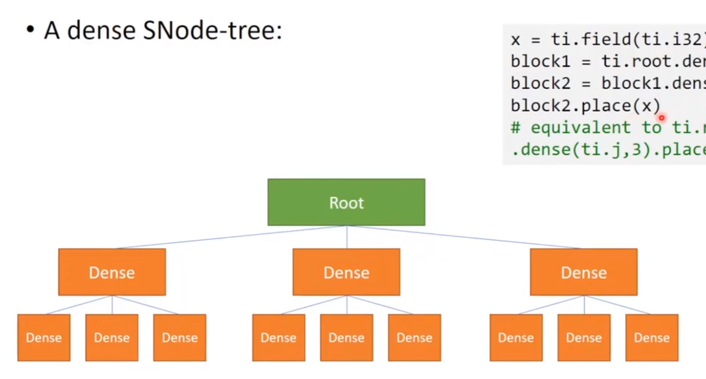

#### 从dense()到pointer()

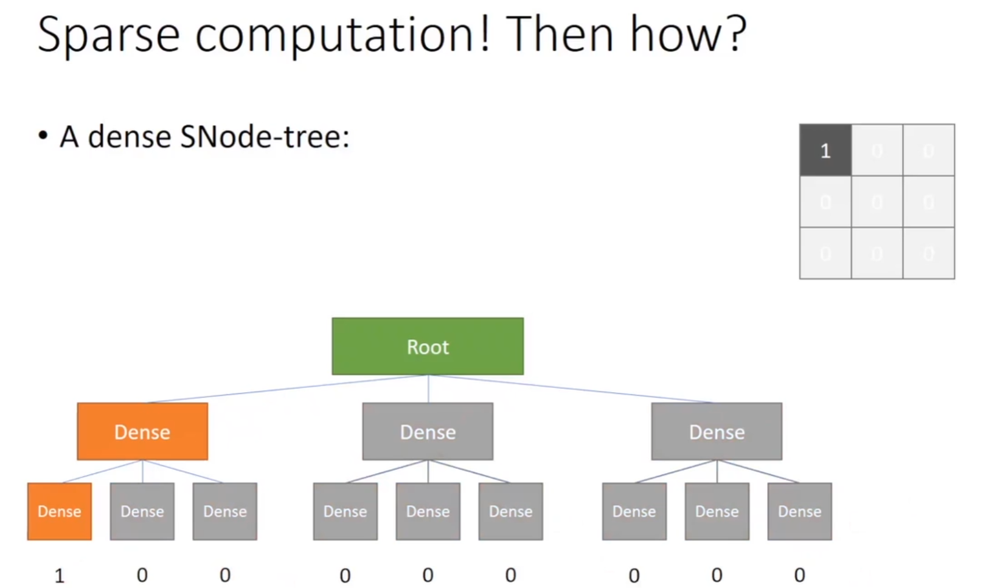

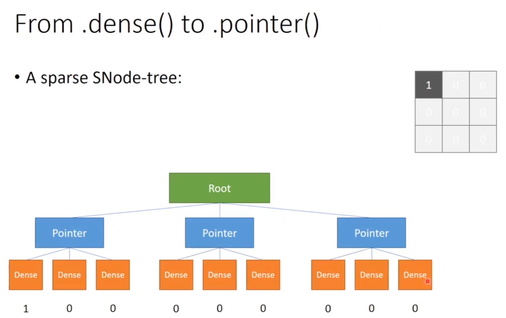

如果一个区域内都是0可以直接把这个指针释放掉，省出空间

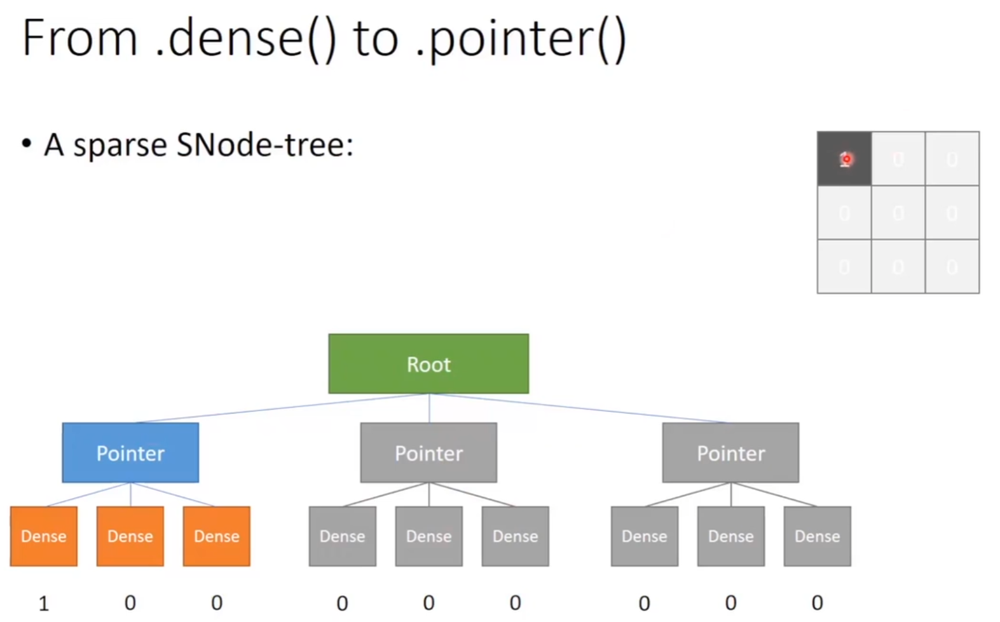

```python
x=ti.field(ti.i32)

block1=ti.root.pointer(ti.i,3)
block2=block1.dense(ti.j,3)
block2.place(x)
```

这样的树在初始化的时候是不会分配任何内存的

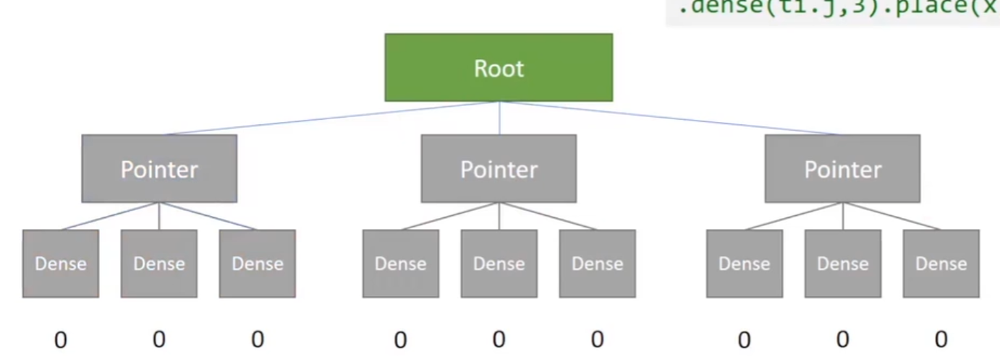

当写入的时候会进行激活

```python
x[0,0]=1
```

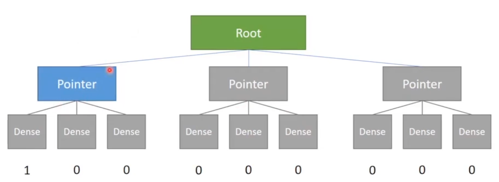

父节点激活后，会把下面的所有cells都激活

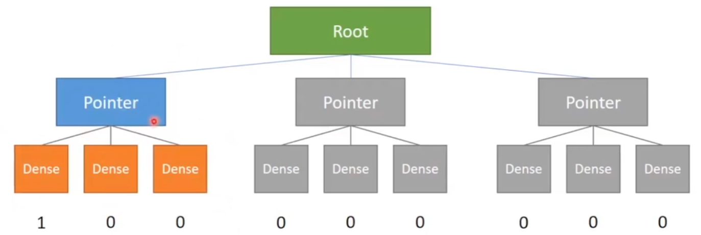

### 访问稀疏数据


* 用struct-for来访问

    * 未被激活的指针会被自动跳过

```python
@ti.kernel
def access_all():
    for i,j in x:
        print(x[i,j]) # 1,0,0
```

* 手动访问未激活的数据会返回0

```python
print(x[2,2]) # 0
```

### 精确分配到每一个cell

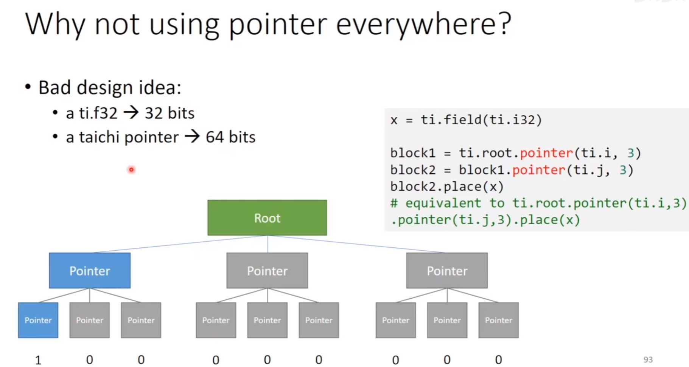

#### bitmasked

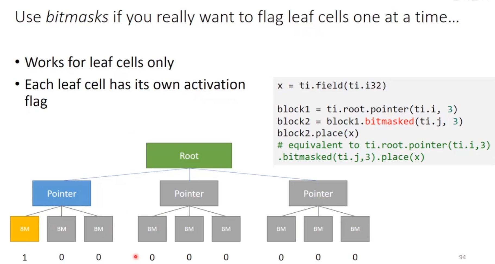

现在用for ij循环时，底层也会跳过空值

```python
@ti.kernel
def access_all():
    for i,j in x:
        print(x[i,j]) # 1
```

### 一些例子

a column-majored 2x4 2D sparse field

```python
x=ti.field(ti.i32)
ti.root.pointer(ti.j,4).dense(ti.i,2).place(x)
```

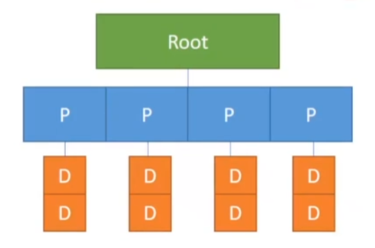

a block-majored (block size=3) 9x1 1D sparse field

```python
x=ti.field(ti.i32)
ti.root.pointer(ti.i,3).bitmasked(ti.i,3).place(x)
```

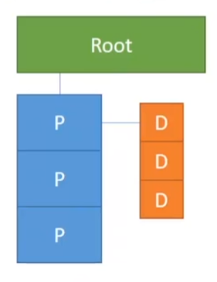

putting things together

```python
x=ti.field(ti.i32)
y=ti.field(ti.i32)
x=ti.field(ti.i32)
p1=ti.root.pointer(ti.j,3)
p2=ti.root.pointer(ti.i,2)
d11=p1.dense(ti.i,2)
d21=p2.dense(ti.i,2)
d22=p2.bitmasked(ti.i,2)
d11.place(x)
d21.place(y)
d22.place(z)
```

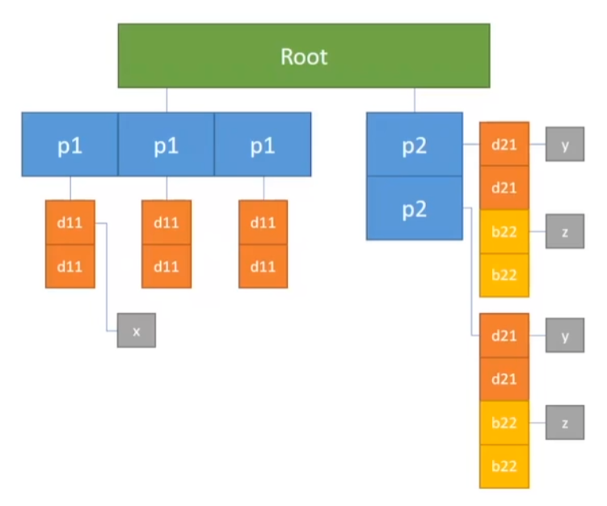

2024.2.6