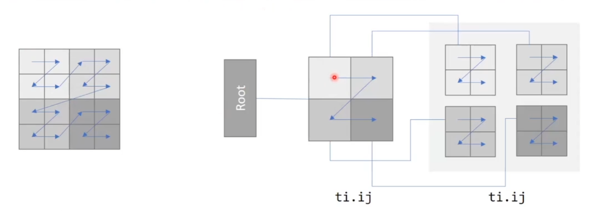
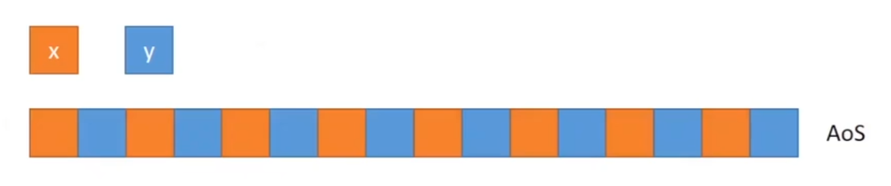

## 高级稠密数据结构

advanced dense data layouts

帮我们让程序跑得更快

我们平时用到taichi.field就是一个advanced dense data layouts

### 数据运算performce cpu vs gpu


#### 串行和并行


#### packed mode

taichi的并行GPU运算需要2的幂次方的数据量

如果不满足的话taichi也会补全成2的幂次方的数据量，牺牲一份空间来换速度，这种模式称为packed mode

```python
ti.init()
a=ti.field(ti.i32,shape=(18,65)) # padded to (32,128)
```

```python
ti.init(packed=True)
a=ti.field(ti.i32,shape=(18,65)) # no padding
```

### 升级ti.field

```python
x=ti.Vector.field(3,ti.f32,shape=16)
```

↓

```python
x=ti.Vector.field(3,ti.f32)
ti.root.dense(ti.i,16).place(x)
```

先声明一个16行的空间，再在每个空间中place向量


#### 更多的例子

```python
x=ti.field(ti.f32,shape=())
```

↓

```python
x=ti.field(ti.f32)
ti.root.place(x)
```

---

```python
x=ti.field(ti.f32,shape=3)
```

↓

```python
x=ti.field(ti.f32)
ti.root.dense(ti.i,3).place(x)
```

---

```python
x=ti.field(ti.f32,shape=(3,4))
```

↓

```python
x=ti.field(ti.f32)
ti.root.dense(ti.ij,(3,4)).place(x)
```

---

```python
x=ti.Matrix.field(2,2,ti.f32,shape=5)
```

↓

```python
x=ti.Matrix.field(2,2,ti.f32)
ti.root.dense(ti.i,5).place(x)
```

### SNODE-tree


#### 拆分二维field

```python
x=ti.field(ti.i32,shape=(4,4))
```

↓

```python
x=ti.field(ti.i32)
ti.root.dense(ti.ij,(4,4)).place(x)
```

↓

```python
x=ti.field(ti.i32)
ti.root.dense(ti.i,4).dense(ti.j,4).place(x)
```


通过这种方法可以指定行主序还是列主序(row-major & column-major)

```python
x=ti.field(ti.i32)
y=ti.field(ti.i32)
ti.root.dense(ti.i,3).dense(ti.j,2).place(x) # row-major
ti.root.dense(ti.j,2).dense(ti.i,3).place(x) # column-major
```


##### 访问行主序&列主序

```python
import taichi as ti
ti.init(arch=ti.cpu,cpu_max_num_threars=1)

x=ti.field(ti.i32)
ti.root.dense(ti.i,3).dense(ti.j,2).place(x) #row major

@ti.kernel
def fill():
    for i,j in x:
        x[i,j]=i*10+j

@ti.kernel
def print_field():
    for i,j in x:
        print('x[',i,',',j,']=',x[i,j],sep=' ',end=' ')

fill()
print_field()
```

```python
import taichi as ti
ti.init(arch=ti.cpu,cpu_max_num_threars=1)

x=ti.field(ti.i32)
ti.root.dense(ti.j,2).dense(ti.i,3).place(x) #column major

@ti.kernel
def fill():
    for i,j in x:
        x[i,j]=i*10+j

@ti.kernel
def print_field():
    for i,j in x:
        print('x[',i,',',j,']=',x[i,j],sep=' ',end=' ')

fill()
print_field()
```

##### 和C++比较

```c++
int x[3][2]; // row-major
int y[2][3]; // column-major

foo(){
    for(int i=0;i<3;i++){
        for(int j=0;j<2;j++){
            do_something(x[i][j])
        }
    }
    for(int j=0;j<2;j++){
        for(int i=0;i<3;i++){
            do_something(y[j][i])
        }
    }
}
```

```python
x=ti.field(ti.f32)
y=ti.field(ti.f32)
ti.root.dense(ti.i,3).dense(ti.j,2).place(x)
ti.root.dense(ti.j,2).dense(ti.i,3).place(y)

@ti.kernel
def foo():
    for i,j in x:
        do_something(x[i,j])
    for i,j in y:
        do_something(y[i,j])
```

#### 层级结构

```python
x=ti.field(ti.i32)
ti.root.dense(ti.i,4).dense(ti.i,4).place(x)
```

仍然是一个一维的field，只不过对数据进行了“分组”


##### 访问具有层级结构的1D field

```python
import taichi as ti
ti.init(arch=ti.cpu)

x=ti.field(ti.i32)
ti.root.dense(ti.i,4).dense(ti.i,4).place(x)

@ti.kernel
def print_id():
    for i in x:
        print(i,end=' ')
```


##### 用处

* 访问时类似一维数组

* 存放时类似二维数组

#### 多维层级结构

```python
x=ti.field(ti.i32)
ti.root.dense(ti.ij,(2,2)).dense(ti.ij,(2,2)).place(x) # block-major
```



### AoS & SoA

```c++
struct S1
{
    int x[8];
    int y[8];
}
S1 soa; 
```

```c++
struct S2
{
    int x;
    int y;
}
S2 aos[8];
```


#### SoA in taichi

```python
x=ti.field(ti.i32)
y=ti.field(ti.i32)
ti.root.dense(ti.i,8).place(x)
ti.root.dense(ti.i,8).place(y)
```


#### AoS in taichi

```python
x=ti.filed(ti.i32)
y=ti.field(ti.i32)
ti.root.dense(ti.i,8).place(x,y)
```

#### taichi aos注意点

* 只有相同形状的field才能以aos的形式进行放置

* 这里的形状是由SNode(dense定义的)

```python
x=ti.field(ti.i32)
y=ti.field(ti.i32)
ti.root.dense(ti.i,8).place(x)
ti.root.dense(ti.i,16).place(y)
# different-shaped fields x and y can not be placed in AoS fashion
```

```python
x=ti.field(ti.i32)
y=ti.Vector(2,ti.i32)
ti.root.dense(ti.i,8).place(x,y)
# scaler field x and vector field y can be placed in AoS fashion
```



#### 转变AOS 和SOA

只要动数据即可，代码不用动


#### 例子

##### SoA N-body

```python
...
pos=ti.Vector.field(2,ti.f32,N)
vel=ti.Vector.field(2,ti.f32,N)
force=ti.Vector.field(2,ti.f32,N)
...
@ti.kernel
def update():
    dt=h/substepping
    for i in range(N):
        vel[i]+=dt*force[i]/m
        pos[i]+=dt*vel[i]
```

##### AoS N-body

```python
pos=ti.Vector.field(2,ti.f32,N)
vel=ti.Vector.field(2,ti.f32,N)
force=ti.Vector.field(2,ti.f32,N)
ti.root.dense(ti.i,N).place(pos,vel,force)
...
@ti.kernel
def update():
    dt=h/substepping
    for i in range(N):
        vel[i]+=dt*force[i]/m
        pos[i]+=dt*vel[i]
```

### 访问高级数据结构

和以往一样访问即可

2024.2.6